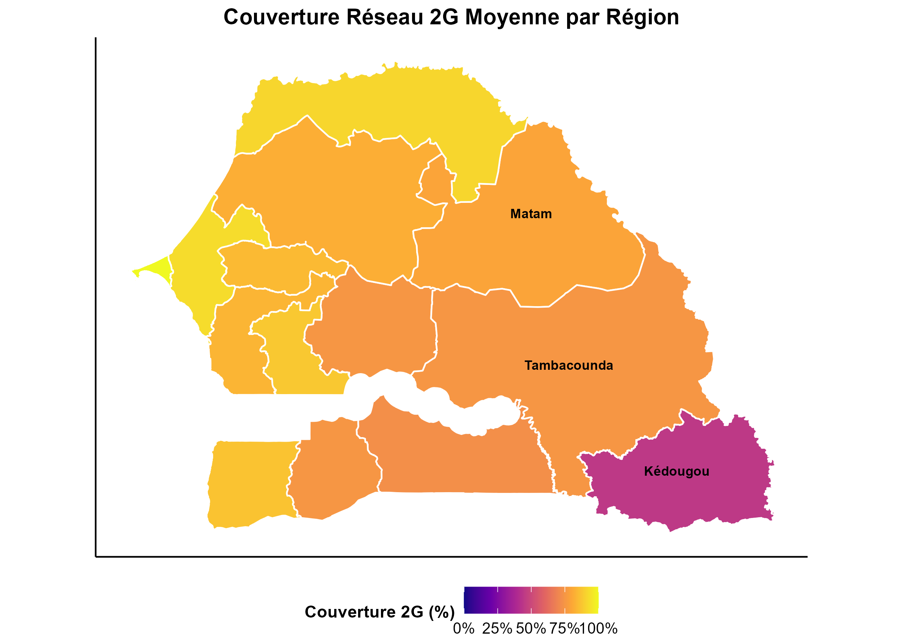
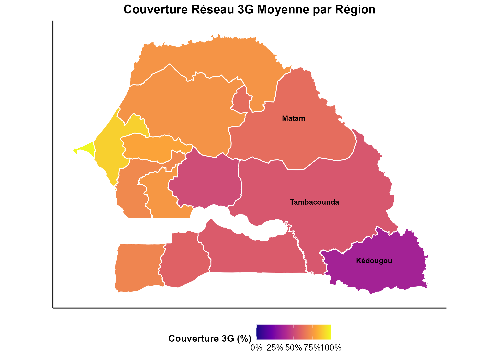
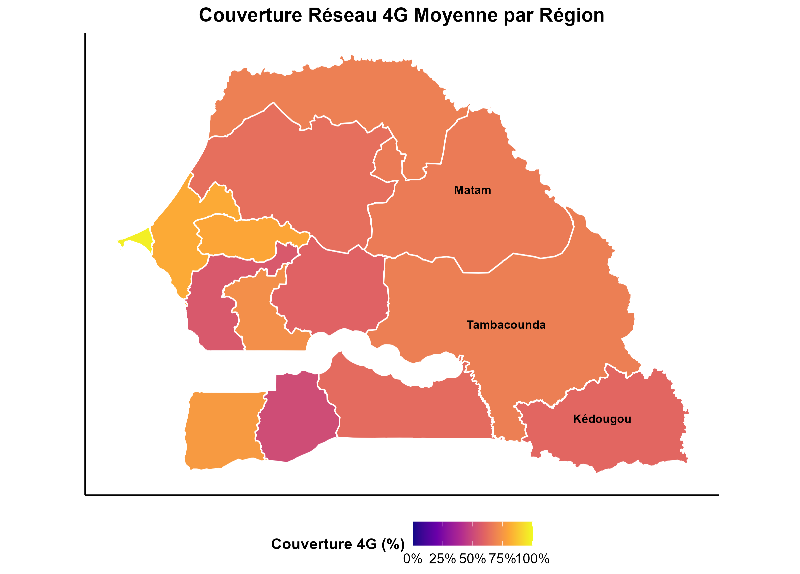

```{r setup, include=FALSE}
knitr::opts_chunk$set(echo = FALSE, 
                      cache = TRUE,
                      warning = FALSE, 
                      message = FALSE,
                      comment = NA,
                      fig.width = 8,
                      fig.height = 5)
library(ggplot2)
library(tidyr)
library(knitr)
```

# Introduction

- La connectivité mobile reste inégale au Sénégal, surtout dans les zones rurales.
- Le placement des antennes est un levier stratégique pour :
  - améliorer la **couverture réseau**,
  - **réduire les interférences**,
  - et **optimiser les coûts**.
- Le projet s’appuie sur un **modèle de simulation** tenant compte :
  - de la **propagation des ondes**,
  - des **contraintes géographiques et budgétaires**,
  - et de l’**allocation des fréquences**.

## Contexte général
**Problématique :** Le placement des antennes de télécommunication est crucial pour assurer une couverture réseau optimale, surtout dans les régions rurales du Sénégal.

**Défis de la connectivité au Sénégal :**

- Couverture inégale entre zones urbaines et rurales
- Qualité de service limitée dans les zones reculées
- Fracture numérique impactant le développement
- Contraintes géographiques et économiques

**Enjeux du placement des antennes :**

- Assurer une couverture efficace
- Minimiser les interférences
- Optimiser les coûts d'installation
- Respecter les contraintes techniques


## Objectifs du projet

**Objectif principal :** Optimiser le placement des antennes pour une meilleure couverture réseau tout en réduisant les interférences


# Zone d'étude

Nous nous concentrons sur trois régions du Sénégal : Kédougou, Tambacounda et Matam. Ces régions présentent des défis uniques en matière de connectivité mobile, notamment en raison de leur géographie et de leur densité de population. Ces régions présente,nt des taux de couverture réseau  de .


# Vue d'ensemble du Sénégal de la couverture reseau 

## Carte de la couverture réseau


```{r , echo=FALSE, fig.align='center', out.width='100%'}
# Vous pouvez ajouter le logo de l'ENSAE ici si vous en avez un

```


```{r , echo=FALSE, fig.align='center', out.width='100%'}
# Vous pouvez ajouter le logo de l'ENSAE ici si vous en avez un

```


```{r , echo=FALSE, fig.align='center', out.width='100%'}
# Vous pouvez ajouter le logo de l'ENSAE ici si vous en avez un

```


## Présentation des régions cibles

**Régions étudiées :** Kédougou, Tambacounda et Matam


**Caractéristiques communes :**

- Situées dans la partie orientale du Sénégal
- Diversité géographique et culturelle
- Faible taux de couverture réseau
- Disparités importantes urbain/rural

**Défis spécifiques :**

- Manque d'infrastructures de télécommunication
- Accès limité à Internet et services mobiles
- Population principalement rurale
- Contraintes géographiques importantes


## Indicateurs clés du Sénégal

**Données démographiques et géographiques :**

- Population : > 18 millions d'habitants (2023)
- Superficie : 196 722 km²
- Taux d'urbanisation : ~47%
- Accès à Internet : ~58% (2022)

**Répartition administrative :**

- 14 régions administratives
- Concentration des infrastructures dans l'ouest
- Zones rurales sous-connectées

# État de la couverture réseau

## Couverture par opérateur

```{r operator-coverage, fig.cap="Comparaison de la couverture par opérateur"}
# Données de couverture par opérateur
operator_data <- data.frame(
  Region = c("Dakar", "Thiès", "Saint-Louis", "Tambacounda", "Kédougou", "Matam"),
  Orange = c(95, 85, 80, 45, 35, 50),
  Free = c(90, 80, 75, 40, 30, 45),
  Expresso = c(85, 75, 70, 35, 25, 40)
)

operator_long <- pivot_longer(operator_data, 
                            cols = c(Orange, Free, Expresso),
                            names_to = "Operateur",
                            values_to = "Couverture")

ggplot(operator_long, aes(x = Region, y = Couverture, fill = Operateur)) +
  geom_bar(stat = "identity", position = "dodge") +
  scale_fill_manual(values = c("Orange" = "orange", "Free" = "red", "Expresso" = "green")) +
  labs(title = "Couverture réseau par opérateur et par région",
       x = "Région", y = "Pourcentage de couverture", fill = "Opérateurs") +
  theme_minimal() +
  theme(axis.text.x = element_text(angle = 45, hjust = 1))
```

## Analyse de la couverture

**Constats principaux :**

- Orange : réseau le plus étendu (95% à Dakar, mais zones blanches rurales)
- Free : couverture concentrée en zones urbaines (90% à Dakar)
- Expresso : couverture la plus faible (85% à Dakar, <50% zones rurales)

**Disparités régionales :**

- Kédougou et Tambacounda : couverture <50% tous opérateurs
- Matam : couverture variable selon l'opérateur
- Concentration des infrastructures dans l'ouest du pays

# Généralités sur les réseaux de télécommunication

## Canaux de communication

**Définition :** Médium de transmission d'information permettant l'acheminement d'un message

**Types de supports :**

- Support physique (câble)
- Support logique (canal radio)

**Caractéristiques importantes :**

- Bande passante du canal
- Capacité de transmission
- Susceptibilité aux interférences

## Spectre de fréquence et modulation

```{r frequency-spectrum, fig.cap="Spectre de fréquence d'un signal"}
# Simulation d'un signal : somme de sinusoïdes
f1 <- 50   # Hz
f2 <- 120  # Hz
sampling_rate <- 1000  # Hz
duration <- 1          # seconde
t <- seq(0, duration, by = 1/sampling_rate)
signal <- sin(2*pi*f1*t) + 0.5*sin(2*pi*f2*t)

# Transformée de Fourier
fft_vals <- abs(fft(signal))^2
freq <- seq(0, sampling_rate, length.out = length(fft_vals))

# Création du spectre
df_spectrum <- data.frame(
  Frequency = freq[1:(length(freq)/2)],
  Power = fft_vals[1:(length(freq)/2)]
)

# Affichage
ggplot(df_spectrum, aes(x = Frequency, y = Power)) +
  geom_line(color = "#0072B2", size = 1) +
  labs(title = "Spectre de fréquence du signal",
       x = "Fréquence (Hz)", y = "Puissance") +
  theme_minimal()
```

## Modulation du signal

```{r modulation, fig.cap="Modulation d'un signal"}
# Paramètres
f_port <- 50      # Fréquence porteuse (Hz)
f_mod <- 5        # Fréquence du signal modulant (Hz)
a_p <- 1          # Amplitude de la porteuse
m <- 0.5          # Indice de modulation
Fs <- 1000        # Fréquence d'échantillonnage
t <- seq(0, 1, by = 1/Fs)

# Signaux
modulant <- sin(2 * pi * f_mod * t)
porteuse <- a_p * cos(2 * pi * f_port * t)
module <- (1 + m * modulant) * porteuse

# Visualisation
df <- data.frame(t = t, Porteuse = porteuse, Modulant = modulant, Signal_Modulé = module)
df_long <- pivot_longer(df, -t, names_to = "Signal", values_to = "Amplitude")

ggplot(df_long, aes(x = t, y = Amplitude, color = Signal)) +
  geom_line() +
  labs(title = "Modulation AM : onde modulante, porteuse et signal modulé",
       x = "Temps (s)", y = "Amplitude") +
  theme_minimal()
```

## Capacité d'un canal - Théorie de Shannon

**Formule de Shannon :**

$$C_I = \Delta f \cdot \log_2 \left(1 + \frac{P_S}{P_N} \right)$$

**Où :**

- $C_I$ : capacité du canal (bits/s)
- $\Delta f$ : largeur de bande (Hz)
- $P_S$ : puissance du signal reçu
- $P_N$ : puissance du bruit

**Implications :**

- Plus la bande passante est large, plus la capacité est élevée
- Importance du rapport signal/bruit (SNR)
- Nécessité de gérer efficacement le spectre

# Propagation des ondes

## Modèle de Friis (espace libre)

**Équation de Friis :**

$$P_r(d) = \frac{P_t G_t G_r \lambda^2}{(4 \pi d)^2 L}$$

**En fonction de la fréquence :**

$$P_r(d) = \frac{P_e G_e G_r c^2}{(4 \pi d f)^2}$$

**Points clés :**

- Atténuation proportionnelle à $d^{-2}$
- Dépendance à $f^{-2}$ : hautes fréquences portent moins loin
- Modèle idéalisé sans obstacles

## Simulation du modèle de Friis

```{r friis-model, fig.cap="Propagation des ondes en espace libre"}
# Paramètres
P_t <- 1e3  # Puissance transmise en watts
G_t <- 10   # Gain de l'antenne émettrice (en dB)
G_r <- 10   # Gain de l'antenne réceptrice (en dB)
c <- 3e8    # Vitesse de la lumière en m/s
f <- 2.4e9  # Fréquence en Hz (2.4 GHz)
L <- 1      # Pertes système (en dB)

# Distance
d <- seq(1, 10000, by = 100)  # Distance de 1 à 10 km

# Calcul de la puissance reçue en dB
P_r <- P_t + G_t + G_r - 20 * log10(4 * pi * d * f / c) - L

# Visualisation
df <- data.frame(Distance = d, Puissance_Reçue = P_r)

ggplot(df, aes(x = Distance, y = Puissance_Reçue)) +
  geom_line(color = "#0072B2", size = 1) +
  scale_x_log10() +
  labs(title = "Propagation des ondes en espace libre (modèle de Friis)",
       x = "Distance (m)", y = "Puissance reçue (dB)") +
  theme_minimal()
```

