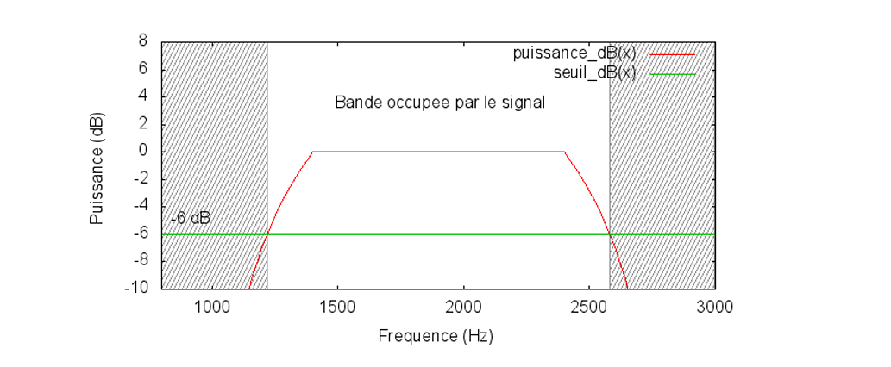

```{r setup, include=FALSE}
knitr::opts_chunk$set(echo = FALSE, 
                      cache = TRUE,
                      warning = FALSE, 
                      message = FALSE,
                      comment = NA)

```


# Introduction


Au Sénégal, comme dans de nombreux pays en développement, l’accès équitable à la connectivité mobile constitue un enjeu majeur. Malgré les avancées technologiques, de nombreuses zones rurales restent encore mal desservies, avec une qualité de service limitée. Cette situation creuse la fracture numérique et freine le développement socio-économique de territoires pourtant porteurs de potentiel.

Dans ce contexte, le **placement des antennes de télécommunication** devient une problématique stratégique. Il ne s'agit pas seulement de couvrir les zones densément peuplées, mais également d'assurer une couverture efficace dans les **zones reculées**, souvent difficiles d’accès, où les contraintes géographiques, économiques et techniques rendent le déploiement complexe. Une mauvaise répartition des stations de base peut engendrer des zones blanches, une mauvaise qualité de service ou encore des interférences entre antennes utilisant les mêmes fréquences.

Ce projet vise ainsi à étudier **l’optimisation du placement des antennes**, avec pour objectif une **meilleure couverture réseau** tout en **réduisant les interférences**. L’approche prend en compte les réalités du terrain, notamment la **propagation des ondes**, la **répartition des fréquences**, ainsi que les **contraintes budgétaires** liées à l’installation et à l’entretien des infrastructures.

Face à la complexité des réseaux actuels, il devient essentiel de recourir à des outils d’aide à la décision basés sur la simulation et l’optimisation. Ce travail propose le développement et l’implémentation d’un modèle de réseau adapté, permettant de tester différentes configurations de placement et d’affectation de fréquence. Deux techniques d’optimisation sont mobilisées : un **algorithme de recherche directe** (MADS) et une **métaheuristique** (la recherche tabou), afin d’explorer efficacement l’espace des solutions possibles.

Les résultats obtenus permettront d’évaluer la performance de la méthode proposée et d’ouvrir la voie à une application à grande échelle dans le contexte sénégalais, en vue de réduire les inégalités d’accès au numérique et d’optimiser l’usage des ressources technologiques disponibles.


---

# Présentation de la zone d’étude :Kédougou, Tambacounda et Matam

Le Sénégal est un pays d'Afrique de l'Ouest, avec une population d'environ 16 millions d'habitants. Le pays est divisé en 14 régions administratives, dont les régions de Kédougou, Tambacounda et Matam, qui sont situées dans la partie orientale du pays.  
Ces régions sont caractérisées par une diversité géographique et culturelle, mais elles partagent également des défis communs en matière de connectivité mobile.

le taux de couverture réseau dans les régions de Kédougou, Tambacounda et Matam est relativement faible, avec des disparités importantes entre les zones urbaines et rurales.
Les zones rurales, en particulier, souffrent d'un manque d'infrastructures de télécommunication, ce qui limite l'accès à Internet et aux services mobiles pour les populations locales.

```{r}

library(sf)
library(ggplot2)
# Charger le shapefile (met le chemin vers ton fichier .shp)
senegal <- st_read("donnee/shp/gadm41_SEN_1.shp")
View(senegal$NAME_1)
```


```{r}
# Tracer la carte avec ggplot2
ggplot(data = senegal) +
  geom_sf(fill = "lightblue", color = "black") +
  geom_sf_text(aes(label = NAME_1), size = 3, color = "darkblue") + # adapte NOM_REGION au nom de ta colonne
  ggtitle("Carte des régions du Sénégal") +
  theme_minimal()

```


# Généralités sur les Réseaux de télécommunicatin 

##  canaux de communication

 En télécommunications ou dans les réseaux informatiques, un canal de commu
nication est un médium de transmission d’information, permettant l’acheminement
 d’un message d’une ou plusieurs sources à un ou plusieurs destinataires. Cette trans
mission d’information peut se faire au travers d’un support physique, comme un câble,
 ou d’un support logique, comme un canal radio.
 


## Spectre de fréquence d’un signal

Lors de la transmission d’un signal dans un câble ou dans l’air, celui-ci est de nature analogique. Pour comprendre comment il transporte l'information, on analyse sa composition fréquentielle à l’aide de la **transformée de Fourier**.

Cette analyse permet d'obtenir le **spectre de fréquences** du signal, c’est-à-dire la répartition de sa puissance selon les différentes fréquences. Pour les signaux réels, l’énergie est souvent concentrée dans une **bande passante limitée**. En dessous d’un certain seuil, la puissance est négligeable, ce qui permet de **délimiter la bande utile** du signal.

### Illustration en R

```{r}
library(ggplot2)

# Simulation d’un signal : somme de sinusoïdes
f1 <- 50   # Hz
f2 <- 120  # Hz
sampling_rate <- 1000  # Hz
duration <- 1          # seconde
t <- seq(0, duration, by = 1/sampling_rate)
signal <- sin(2*pi*f1*t) + 0.5*sin(2*pi*f2*t)

# Transformée de Fourier
fft_vals <- abs(fft(signal))^2
freq <- seq(0, sampling_rate, length.out = length(fft_vals))

# Création du spectre
df_spectrum <- data.frame(
  Frequency = freq[1:(length(freq)/2)],
  Power = fft_vals[1:(length(freq)/2)]
)

# Affichage
ggplot(df_spectrum, aes(x = Frequency, y = Power)) +
  geom_line(color = "#0072B2", size = 1) +
  labs(title = "Spectre de fréquence du signal",
       x = "Fréquence (Hz)",
       y = "Puissance") +
  theme_minimal()
```

## Bande passante d’un canal

Il est très important de connaître les caractéristiques fréquentielles du canal sur
 lequel on veut transmettre de l’information. En effet, un canal ne peut transporter des
 signaux que dans une certaine bande de fréquences, appelée bande passante du canal.
 
```{r echo=FALSE, out.width="85%", fig.align='center'}

```
##  Modulation du signal

Afin de permettre la transmission d’un signal sur un support donné, il est souvent nécessaire d’adapter sa fréquence pour qu’elle corresponde à la bande passante du canal de transmission. Cette opération est réalisée par le procédé de modulation.

La modulation consiste à combiner le signal à transmettre, initialement en bande de base, avec une onde porteuse : une onde sinusoïdale de fréquence fP​ et d’amplitude $a_p$​, généralement située au centre de la bande passante du support. Mathématiquement, cette onde porteuse peut s’écrire :
$$
s_P(t) = a_P \cos(2\pi f_P t)
$$
```{r}
# Paramètres
f_port <- 50      # Fréquence porteuse (Hz)
f_mod <- 5        # Fréquence du signal modulant (Hz)
a_p <- 1          # Amplitude de la porteuse
m <- 0.5          # Indice de modulation
Fs <- 1000        # Fréquence d'échantillonnage
t <- seq(0, 1, by = 1/Fs)

# Signal modulant (bande de base)
modulant <- sin(2 * pi * f_mod * t)

# Porteuse
porteuse <- a_p * cos(2 * pi * f_port * t)

# Signal modulé en amplitude (AM)
module <- (1 + m * modulant) * porteuse

# Visualisation
library(ggplot2)
library(tidyr)
df <- data.frame(
  t = t,
  Porteuse = porteuse,
  Modulant = modulant,
  Signal_Modulé = module
)

df_long <- pivot_longer(df, -t, names_to = "Signal", values_to = "Amplitude")

ggplot(df_long, aes(x = t, y = Amplitude, color = Signal)) +
  geom_line() +
  labs(title = "Modulation d'un signal : onde modulante, porteuse et signal modulé (AM)",
       x = "Temps (s)", y = "Amplitude") +
  theme_minimal()

```


En modulant cette onde avec le signal d’origine, on obtient un signal modulé dont le spectre est déplacé autour de la fréquence fPf​. Ce nouveau signal respecte les contraintes fréquentielles du support et peut donc être transmis efficacement.

## Capacité d’un canal de transmission – Théorie de Shannon

Les signaux électromagnétiques transmis dans un réseau de télécommunications sont, comme vu précédemment, des **signaux modulés**. Leur spectre est étalé autour d’une fréquence centrale, en fonction de la technique de modulation utilisée. 

Or, le **canal de transmission**, ici l’air, ne permet de transmettre que certaines fréquences : c’est ce qu’on appelle la **bande passante** du canal, notée \( \Delta f \). Elle représente l’intervalle de fréquences que le support peut transmettre sans atténuation excessive.

La **théorie de l’information de Shannon** établit un lien fondamental entre cette bande passante et la **capacité maximale** du canal à transporter de l’information, exprimée en bits par seconde :

$$
C_I = \Delta f \cdot \log_2 \left(1 + \frac{P_S}{P_N} \right)
$$

**Avec :**
- \( C_I \) : capacité du canal (en bits/s) ;
- \( \Delta f \) : largeur de bande (Hz) ;
- \( P_S \) : puissance du signal reçu ;
- \( P_N \) : puissance du bruit (perturbations).

Cette formule montre que plus **la bande passante** est large, plus le canal est capable de transporter de l’information, à condition que le **rapport signal/bruit (SNR)** soit favorable. C’est pourquoi la **gestion efficace du spectre** et la **réduction des interférences** sont cruciales dans la conception des réseaux de télécommunications.


## Propagation des ondes dans un réseau de télécommunications

Dans un réseau de télécommunications, les informations sont transmises à l’aide d’**ondes radio**, émises et reçues par les différentes composantes du réseau, notamment les **stations de base** et les **terminaux utilisateurs**. Ces ondes se propagent dans l’air, mais leur puissance diminue progressivement avec la distance à l’émetteur, ou lorsqu’elles rencontrent des obstacles tels que les bâtiments ou le relief.

Afin de **déterminer la zone géographique couverte** par une antenne, il est essentiel de connaître la **puissance du signal reçu** en différents points du territoire.

La première étape de la modélisation d’un réseau de télécommunications consiste donc à **modéliser la propagation des ondes radio**. Cette propagation est influencée par de nombreux facteurs (réflexion, diffraction, absorption...), rendant certains modèles complexes à mettre en œuvre. 

Dans cette section, nous commencerons par étudier le **modèle le plus simple**, celui de la **propagation en espace libre (dans le vide)**, avant d’aborder des modèles plus réalistes prenant en compte les **principaux phénomènes physiques** qui altèrent la propagation des ondes.


## Modélisation de la propagation des ondes

### Modèle de propagation dans le vide (Equation de Friis)

Dans le modèle idéalisé sans obstacles (propagation en espace libre), la puissance reçue est donnée par **l’équation de Friis** :

$$
P_r(d) = \frac{P_t G_t G_r \lambda^2}{(4 \pi d)^2 L}
$$

**Où :**
- $P_r(d)$ : puissance reçue à une distance $d$
- $P_t$ : puissance transmise
- $G_t$, $G_r$ : gain des antennes émettrice et réceptrice
- $\lambda$ : longueur d’onde ($\lambda = c / f$)
- $L$ : pertes système (câbles, connecteurs...)
- $d$ : distance entre émetteur et récepteur

En dB, cela devient :

$$
P_r(dB) = P_t(dB) + G_t(dB) + G_r(dB) - 20\log_{10}(4\pi d / \lambda) - L(dB)
$$


En télécommunications, il est souvent plus pratique de travailler avec la **fréquence** plutôt qu’avec la **longueur d’onde**. En utilisant la relation \( f = \frac{c}{\lambda} \), où \( c \) est la vitesse de la lumière, l’équation de Friis peut être réécrite de la manière suivante :

$$
P_r(d) = \frac{P_e G_e G_r c^2}{(4 \pi d f)^2}
$$

Cette forme met en évidence deux points essentiels :

-  **Dépendance à la fréquence** : la puissance reçue est inversement proportionnelle au **carré de la fréquence** (\( f^{-2} \)). Cela signifie que plus la fréquence d’un signal est élevée, plus sa portée est limitée. Les signaux à haute fréquence se propagent donc **moins loin** que ceux à basse fréquence.

-  **Dépendance à la distance** : la puissance reçue décroît rapidement avec la **distance** entre l’émetteur et le récepteur, suivant un facteur \( d^{-2} \). Cela reflète l’atténuation naturelle des ondes dans l’espace libre, même en l’absence d’obstacles.

 
### Modèle de propagation en espace libre (Friis) en R
```{r}
# Paramètres
library(ggplot2)
P_t <- 1e3  # Puissance transmise en watts
G_t <- 10  # Gain de l'antenne émettrice (en dB)
G_r <- 10  # Gain de l'antenne réceptrice (en dB)
c <- 3e8  # Vitesse de la lumière en m/s
f <- 2.4e9  # Fréquence en Hz (ex: 2.4 GHz)
L <- 1  # Pertes système (en dB)
# Distance
d <- seq(1, 10000, by = 100)  # Distance de 1 à 10 km
# Calcul de la puissance reçue en dB
P_r <- P_t + G_t + G_r - 20 * log10(4 * pi * d * f / c) - L
# Création du data frame
df <- data.frame(Distance = d, Puissance_Reçue = P_r)
# Visualisation
ggplot(df, aes(x = Distance, y = Puissance_Reçue)) +
  geom_line(color = "#0072B2", size = 1) +
  scale_x_log10() +  # Échelle logarithmique pour la distance
  labs(title = "Propagation des ondes en espace libre (modèle de Friis)",
       x = "Distance (m)", y = "Puissance reçue (dB)") +
  theme_minimal()
```


## Propagation en présence d’obstacles


En présence d'obstacles, la propagation des ondes est modifiée par des phénomènes tels que la diffraction, la réflexion et l'absorption. La diffraction permet aux ondes de courber autour des obstacles, et l'interférence peut produire des configurations d'ondes complexes. 
Deux types d’approches sont couramment utilisés pour modéliser la propagation des
ondes lorsque les obstacles sont pris en compte : une approche théorique ou une
approche empirique.

### Approche théorique

L’approche théorique repose sur des modèles mathématiques basés sur les principes de la physique des ondes. Ces modèles prennent en compte les phénomènes de diffraction, de réflexion et d’absorption. Parmi les modèles théoriques les plus connus, on trouve :

Le modèle de réflexion sur le sol, présenté dans [Rappaport (2002b)], prend en compte deux trajets : un en ligne directe et un autre obtenu par réflexion sur le sol.

Les modèles de Walfisch-Bertoni et d’Ikegami, décrits dans [Granatstein (2008)], intègrent les effets de diffraction des ondes au niveau des toits d’immeubles. 
Ces modèles sont particulièrement pertinents lorsque l’antenne est placée au-dessus des bâtiments et que le récepteur se trouve en contrebas, dans une rue.

## Approche empirique

L’approche empirique peut être illustrée par le modèle de **Delisle-Egli**, présenté dans \cite{Granatstein2008}, qui est un modèle de propagation en milieu urbain.  
Il se base sur un grand nombre de mesures effectuées dans des villes des États-Unis,  
qui ont permis d’établir la formule suivante pour l’atténuation de la puissance d’un signal :

\[
L_{\text{empirique}} =
\begin{cases}
4.27 \times 10^{-17} \dfrac{d^4 f^2}{h_b^2 h_m} & \text{si } h_m < 10\,\text{m} \\
4.27 \times 10^{-17} \dfrac{d^4 f^2}{h_b^2 h_m^2} & \text{si } h_m > 10\,\text{m}
\end{cases}
\tag{2.4}
\]

Ce modèle est particulièrement adapté aux environnements urbains.  
Cependant, pour prendre en compte la variabilité des densités du milieu — allant des zones rurales ouvertes aux centres urbains très denses —  
il est courant d’utiliser un modèle plus général pour l’atténuation \( L \) de la puissance du signal. Ce modèle repose sur la relation suivante :

\[
L = K d^{\alpha} f^2
\tag{2.5}
\]

où :
- \( K \) est une constante dépendant du milieu,
- \( d \) est la distance entre l’émetteur et le récepteur,
- \( f \) est la fréquence du signal,
- \( \alpha \in [2, 4] \) est un paramètre caractérisant la densité du milieu de propagation :
  - \( \alpha \approx 2 \) dans les milieux dégagés comme les zones rurales,
  - \( \alpha \approx 4 \) dans les environnements très denses tels que les zones urbaines.

Ce modèle permet une modélisation souple et adaptée à différents contextes de propagation.


# Rapport signal-bruit

## Définition du rapport signal-bruit (SNR)
 Le rapport signal-bruit, souvent noté SIR (pour Signal to Interference Ratio), est
 défini comme le rapport entre la puissance reçue d’une source PS et la puissance des
 interférences perturbant la réception PI :
$$
\text{SNR} = \frac{P_{signal}}{P_{bruit}}
$$
**Où :**
- \( P_{signal} \) : puissance du signal utile
- \( P_{bruit} \) : puissance du bruit de fond

ou encore en décibels

$$
\text{SIR}_{dB} = 10 \log_{10} \left( \frac{P_{signal}}{P_{bruit}} \right)
$$


## Zone de couverture

La **zone de couverture** d’une antenne est définie comme l’ensemble des points où la puissance reçue dépasse un seuil minimal, généralement fixé par l’opérateur.La zone de couverture d’une antenne est l’ensemble des points du plan où la qualité
 du signal reçu de cette antenne est suffisante pour pouvoir effectuer une communica
tion. Elle est définie à partir du rapport signal-bruit, de la façon suivante :
$$
\text{Zone de couverture} = \{ x \in \mathbb{R}^2 \mid \text{SIR}(x) \geq \theta \}
$$

## Tableau : Répartition des bandes de fréquences

```{r, results='asis', echo=FALSE}
library(knitr)

# Création du tableau
freq_table <- data.frame(
  Génération = c("2G", "3G", "4G", "5G"),
  Technologie = c("GSM", "UMTS", "LTE", "NR"),
  `Bandes principales (MHz)` = c("900, 1800", "2100", "800, 1800", "3500 (prévu)"),
  Observations = c(
    "Utilisation prédominante du 900 MHz, avec certaines utilisations du 1800 MHz.",
    "Déployée principalement sur la bande des 2100 MHz.",
    "Licences attribuées en 2016, avec des déploiements sur les bandes 800 et 1800 MHz.",
    "Consultation publique lancée pour l'attribution des fréquences 5G, notamment dans la bande des 3,5 GHz."
  )
)

# Affichage du tableau
kable(freq_table, format = "markdown", align = "c")
```

## Optimisation du placement des antennes
L’optimisation du placement des antennes est un enjeu crucial pour garantir une couverture réseau efficace et minimiser les interférences. 
L'optimisation du placement des antennes dans les régions de **Kédougou, Tambacounda et Matam** doit répondre à des défis spécifiques :
- **Couverture hétérogène** : Zones urbaines vs. zones rurales étendues
- **Contraintes géographiques** : Relief accidenté et végétation dense
- **Ressources limitées** : Nécessité de minimiser le nombre d'antennes

```{r}
library(ggplot2)
library(dplyr)

# Les régions à mettre en couleur spéciale
regions_of_interest <- c("Kédougou", "Tambacounda", "Matam")

# Ajouter une colonne pour distinguer les régions d'intérêt
senegal <- senegal %>%
  mutate(color_fill = ifelse(NAME_1 %in% regions_of_interest, "highlight", "other"))

# Tracer la carte sans légende
ggplot(data = senegal) +
  geom_sf(aes(fill = color_fill), color = "black", show.legend = FALSE) +  # désactiver légende ici
  geom_sf_text(aes(label = NAME_1), size = 3, color = "darkblue") +
  scale_fill_manual(values = c("highlight" = "lightgreen", "other" = "gray90")) +
  ggtitle("Carte du Sénégal avec régions de Kédougou, Tambacounda et Matam en couleur") +
  theme_minimal()

```

```{r}
senegal$NAME_1 %>% unique()
```
# Modélisation mathématique du problème
L’optimisation du placement des antennes peut être formulée comme un problème d’**optimisation combinatoire**. 
On peut formuler ce problème comme un problème d’optimisation combinatoire avec contraintes.

1. Variables de décision

Soit un ensemble discret de points candidats pour l’implantation d’antennes, P={p1,p2,...,pN}
On définit une variable binaire $x_i$ pour chaque point $p_i$ :
$$
x_i = \begin{cases} 
1 & \text{si une antenne est placée en } p_i \\
0 & \text{sinon}
\end{cases}
$$


2. Fonction objectif

On cherche à minimiser le nombre total d’antennes installées :
$$
\min \sum_{i=1}^{N} x_i
$$
3. Contraintes

On souhaite que chaque point qj dans la zone étudiée (ensemble Q={q1,...,qM}) soit couvert par au moins une antenne avec un signal suffisant.

On définit une fonction de couverture binaire $C_{ij}$​ :
$$
C_{ij} = \begin{cases}
1 & \text{si le point } q_j \text{ est couvert par l'antenne } p_i \\
0 & \text{sinon}
\end{cases}
$$
La contrainte de couverture est alors :
$$
\sum_{i=1}^{N} C_{ij} x_i \geq 1 \quad \forall j \in Q
$$

Formulation du problème :

```math
\text{min } \sum_{i=1}^{N} x_i
```

Sous contraintes :

```math
\sum_{i=1}^{N} C_{ij} x_i \geq 1 \quad \forall j \in Q \\
x_i \in \{0, 1\} \quad \forall i \in P
```


## Méthodes d’optimisation

Plusieurs techniques peuvent être employées pour résoudre ce problème

### 1. Méthodes exactes (programmation linéaire en nombres entiers - PLNE)

Ces méthodes résolvent le problème de manière exacte, mais deviennent **coûteuses en temps de calcul** lorsque \( N \) et \( M \) sont grands.
### 2. Méthodes heuristiques
Les méthodes heuristiques fournissent des solutions approximatives en un temps raisonnable. Parmi les plus courantes, on trouve :
- **Algorithmes gloutons** : Sélectionnent les points les plus prometteurs à chaque étape.
- **Recherche locale** : Améliorent une solution initiale en effectuant des modifications locales.
- **Algorithmes génétiques** : Inspirés de la sélection naturelle, ils utilisent des populations de solutions et des opérateurs génétiques (croisement, mutation) pour explorer l’espace des solutions.


## Étapes de Résolution

### 1. Simplification et Analyse

Le problème est une instance du **Set Covering Problem**, connu pour être **NP-difficile**. Nous utilisons des techniques classiques pour les problèmes combinatoires.

### 2. Méthode Exacte : Programmation Linéaire en Nombres Entiers (PLNE)

**Approche :** Utilisation d’un solveur PLNE pour trouver la solution optimale.

#### Exemple avec des données synthétiques :


**Données :**

- $N = 5$ points candidats
- $M = 8$ points à couvrir

**Matrice de couverture $C_{ij}$ (exemple fictif)** :


```text
C = 
1 0 1 0 0  
0 1 0 1 0  
1 0 0 1 0  
0 1 0 0 1  
0 0 1 0 1  
1 0 0 0 0  
0 1 0 1 0  
0 0 1 0 1
```

**Explication :** $C_{1,1} = 1$ signifie que l’antenne $p_1$ couvre le point $q_1$.

#### Résolution :

- **Fonction objectif :** $min(x_1 + x_2 + x_3 + x_4 + x_5)$
- **Contraintes :** Pour chaque $q_j$, au moins une antenne couvrante est sélectionnée.

Par exemple :  
$q_1$: $x_1 + x_3 \geq 1$

**Solution optimale (avec GLPK ou autre solveur) :**  
$x_1 = 1$, $x_2 = 1$, $x_4 = 1$, autres $x_i = 0$  
→ **3 antennes utilisées.**

### 3. Méthode Approchée : Algorithme Glouton

Quand $N$ est grand, les méthodes exactes deviennent impraticables.  
Un **algorithme glouton** fournit une solution **rapide mais sous-optimale**.

**Algorithme :**

1. Initialiser $x_i = 0$, `couverts = ∅`.
2. Tant que `couverts ≠ Q` :
    - Choisir $p_i$ non sélectionné couvrant **le plus de points non couverts**.
    - Fixer $x_i = 1$.
    - Ajouter les points couverts par $p_i$ à `couverts`.
**Application sur l’exemple :**

- Itération 1 : $p_1$ couvre $\{q_1, q_3, q_6\}$.
- Itération 2 : $p_2$ couvre $\{q_2, q_4, q_7\}$.
- Itération 3 : $p_5$ couvre $\{q_5, q_8\}$.

**Solution finale :** $x_1 = x_2 = x_5 = 1$ → **3 antennes.**

### 4. Extension avec Interférences (Modèle Avancé)

Si on ajoute des contraintes de rapport signal/bruit (SNR), le problème devient :

```math
\frac{P_{ij}}{\sum_{k \neq i} P_{kj} x_k + N_0} \geq \theta \quad \text{pour tout } q_j \text{ couvert par } p_i
```

**Réformulation :**

- Introduire des variables supplémentaires pour modéliser les interférences.
- Utiliser des techniques de **linéarisation** ou **branch-and-bound**.

## Résumé des Solutions


| Méthode         | Avantages                       | Inconvénients                  | Complexité     |
|-----------------|----------------------------------|--------------------------------|----------------|
| PLNE            | Solution exacte                 | Inefficace pour $N$ grand      | Exponentielle  |
| Glouton         | Rapide, scalable                | Solution sous-optimale         | $\mathcal{O}(N^2)$ |
| Métaheuristiques| Adapté aux problèmes complexes  | Nécessite réglage des paramètres| Variable        |


## Optimisation du 

# Modèles de propagation des ondes
## Loi de décroissance de la puissance (modèle simplifié)
$$
P_r(d) = P_0 \left(\frac{d_0}{d}\right)^2
$$


## Loi de décroissance de la puissance (modèle général)

$$
P_r(d) = P_0 \left(\frac{d_0}{d}\right)^n
$$

- $P_0$ : puissance à distance référence $d_0$
- $n$ : coefficient d’affaiblissement (entre 2 et 5)

---

# Multiplexage et répartition des fréquences

## Multiplexage Fréquentiel (FDMA)

On divise le spectre en $N$ canaux :

$$
B_{total} = N \cdot B_{canal}
$$

Chaque utilisateur utilise un canal fixe.

## Multiplexage Temporel (TDMA)

Le temps est divisé en $C$ créneaux de durée $T$ :

$$
T_{total} = C \cdot T
$$

Chaque utilisateur communique à tour de rôle.

## Combiné TDMA/FDMA

Chaque canal fréquentiel est subdivisé en créneaux temporels, pour une meilleure utilisation du spectre.

---

# Optimisation du placement des antennes

## Objectif de couverture

Donnons un modèle mathématique :

Soit $x_i$ les coordonnées des antennes à placer, $y_j$ les points à couvrir.

- $P_{ij}$ : puissance reçue à $y_j$ depuis l’antenne $i$.
- $\gamma$ : seuil minimum de puissance.

**Contraintes :**

$$
P_{ij} \geq \gamma \quad \text{pour tous } j \,\Rightarrow \, y_j \,\text{est couvert}
$$

**Fonction objectif (par exemple) :**

- Max. nombre de points couverts
- Min. nombre d'antennes placées
- Max. somme de puissances reçues (pondérées)

## Modèles d'interférences

Le rapport signal-bruit (SNR) :

$$
\text{SNR} = \frac{P_{signal}}{P_{bruit} + P_{interférences}}
$$

Une zone est jugée couverte si $\text{SNR} \geq \theta$ (seuil).

---

# Optimisation de l'assignation de fréquences

On affecte à chaque antenne $i$ une fréquence $f_i \in \mathcal{F}$.

Objectif : 

$$
\min \sum_{(i,j) \in \text{Paires}} I_{ij}(f_i, f_j)
$$

- $I_{ij}$ : fonction modélisant les interferences entre antennes $i$ et $j$.

C’est un **problème combinatoire**, souvent traité par :

- Algorithmes gloutons
- Algorithmes génétiques
- Recuit simulé (simulated annealing)
- Programmation linéaire en nombres entiers (MILP)

---

# Optimisation conjointe (placement + fréquence)

Fonction objectif conjointe :

$$
\min \Big[ \text{coût}_{placement} + \text{interférences} \Big]
$$

On doit déterminer simultanément :

- Coordonnées $x_i$ des antennes
- Fréquences $f_i$ associées

Algorithmes utilisables :

- Algorithmes évolutionnaires multi-objectifs
- Algorithmes hybrides

---

# Implémentation R (idées)

- Simuler une grille 10x10 avec `expand.grid()`
- Calculer les distances et puissances avec `dist()` et la formule de Friis
- Optimisation via `optim()`, `GA`, `GenSA`
- Visualisation avec `ggplot2`, `leaflet`, `shiny`

---

# Conclusion

Ce projet propose une modélisation rigoureuse du placement optimal des antennes, intégrant les principes physiques de propagation, les contraintes réseaux, et l’optimisation combinatoire. Il peut servir de base à une application Shiny interactive pour l’analyse territoriale au Sénégal.
