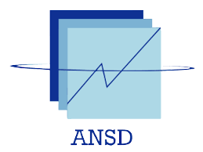

``````{=openxml}

<w:tbl xmlns:w="http://schemas.openxmlformats.org/wordprocessingml/2006/main" xmlns:r="http://schemas.openxmlformats.org/officeDocument/2006/relationships" xmlns:w14="http://schemas.microsoft.com/office/word/2010/wordml" xmlns:wp="http://schemas.openxmlformats.org/drawingml/2006/wordprocessingDrawing" xmlns:a="http://schemas.openxmlformats.org/drawingml/2006/main" xmlns:pic="http://schemas.openxmlformats.org/drawingml/2006/picture"><w:tblPr><w:tblLayout w:type="autofit"/><w:jc w:val="center"/><w:tblW w:type="pct" w:w="5000"/><w:tblLook w:firstRow="1" w:lastRow="0" w:firstColumn="0" w:lastColumn="0" w:noHBand="0" w:noVBand="1"/></w:tblPr><w:tr><w:trPr><w:trHeight w:val="360" w:hRule="auto"/></w:trPr>body1<w:tc><w:tcPr><w:tcBorders><w:bottom w:val="none" w:sz="0" w:space="0" w:color="000000"/><w:top w:val="none" w:sz="0" w:space="0" w:color="000000"/><w:left w:val="none" w:sz="0" w:space="0" w:color="000000"/><w:right w:val="none" w:sz="0" w:space="0" w:color="000000"/></w:tcBorders><w:shd w:val="clear" w:color="auto" w:fill="FFFFFF"/><w:tcMar><w:top w:w="0" w:type="dxa"/><w:bottom w:w="0" w:type="dxa"/><w:left w:w="0" w:type="dxa"/><w:right w:w="0" w:type="dxa"/></w:tcMar><w:vAlign w:val="center"/></w:tcPr><w:p><w:pPr><w:pStyle w:val="Normal"/><w:jc w:val="center"/><w:pBdr><w:bottom w:val="none" w:sz="0" w:space="0" w:color="000000"/><w:top w:val="none" w:sz="0" w:space="0" w:color="000000"/><w:left w:val="none" w:sz="0" w:space="0" w:color="000000"/><w:right w:val="none" w:sz="0" w:space="0" w:color="000000"/></w:pBdr><w:spacing w:after="100" w:before="100" w:line="240"/><w:ind w:left="100" w:right="100" w:firstLine="0" w:firstLineChars="0"/><w:rPr><w:rFonts w:ascii="Times New Roman" w:hAnsi="Times New Roman" w:eastAsia="Times New Roman" w:cs="Times New Roman"/><w:i w:val="false"/><w:b w:val="true"/><w:u w:val="none"/><w:sz w:val="28"/><w:szCs w:val="28"/><w:color w:val="000000"/></w:rPr></w:pPr><w:r xmlns:w="http://schemas.openxmlformats.org/wordprocessingml/2006/main" xmlns:wp="http://schemas.openxmlformats.org/drawingml/2006/wordprocessingDrawing" xmlns:r="http://schemas.openxmlformats.org/officeDocument/2006/relationships" xmlns:w14="http://schemas.microsoft.com/office/word/2010/wordml"><w:rPr><w:rFonts w:ascii="Times New Roman" w:hAnsi="Times New Roman" w:eastAsia="Times New Roman" w:cs="Times New Roman"/><w:i w:val="false"/><w:b w:val="true"/><w:u w:val="none"/><w:sz w:val="28"/><w:szCs w:val="28"/><w:color w:val="000000"/></w:rPr><w:t xml:space="preserve">REPUBLIQUE DU SENEGAL</w:t></w:r></w:p></w:tc></w:tr></w:tbl>
``````

|                                                     |
|:---------------------------------------------------:|
| {width="3cm" height="3cm"} |


``````{=openxml}

<w:tbl xmlns:w="http://schemas.openxmlformats.org/wordprocessingml/2006/main" xmlns:r="http://schemas.openxmlformats.org/officeDocument/2006/relationships" xmlns:w14="http://schemas.microsoft.com/office/word/2010/wordml" xmlns:wp="http://schemas.openxmlformats.org/drawingml/2006/wordprocessingDrawing" xmlns:a="http://schemas.openxmlformats.org/drawingml/2006/main" xmlns:pic="http://schemas.openxmlformats.org/drawingml/2006/picture"><w:tblPr><w:tblLayout w:type="autofit"/><w:jc w:val="center"/><w:tblW w:type="pct" w:w="5000"/><w:tblLook w:firstRow="1" w:lastRow="0" w:firstColumn="0" w:lastColumn="0" w:noHBand="0" w:noVBand="1"/></w:tblPr><w:tr><w:trPr><w:trHeight w:val="360" w:hRule="auto"/></w:trPr>body1<w:tc><w:tcPr><w:tcBorders><w:bottom w:val="none" w:sz="0" w:space="0" w:color="000000"/><w:top w:val="none" w:sz="0" w:space="0" w:color="000000"/><w:left w:val="none" w:sz="0" w:space="0" w:color="000000"/><w:right w:val="none" w:sz="0" w:space="0" w:color="000000"/></w:tcBorders><w:shd w:val="clear" w:color="auto" w:fill="FFFFFF"/><w:tcMar><w:top w:w="0" w:type="dxa"/><w:bottom w:w="0" w:type="dxa"/><w:left w:w="0" w:type="dxa"/><w:right w:w="0" w:type="dxa"/></w:tcMar><w:vAlign w:val="center"/></w:tcPr><w:p><w:pPr><w:pStyle w:val="Normal"/><w:jc w:val="center"/><w:pBdr><w:bottom w:val="none" w:sz="0" w:space="0" w:color="000000"/><w:top w:val="none" w:sz="0" w:space="0" w:color="000000"/><w:left w:val="none" w:sz="0" w:space="0" w:color="000000"/><w:right w:val="none" w:sz="0" w:space="0" w:color="000000"/></w:pBdr><w:spacing w:after="100" w:before="100" w:line="240"/><w:ind w:left="100" w:right="100" w:firstLine="0" w:firstLineChars="0"/><w:rPr><w:rFonts w:ascii="Times New Roman" w:hAnsi="Times New Roman" w:eastAsia="Times New Roman" w:cs="Times New Roman"/><w:i w:val="false"/><w:b w:val="true"/><w:u w:val="none"/><w:sz w:val="28"/><w:szCs w:val="28"/><w:color w:val="000000"/></w:rPr></w:pPr><w:r xmlns:w="http://schemas.openxmlformats.org/wordprocessingml/2006/main" xmlns:wp="http://schemas.openxmlformats.org/drawingml/2006/wordprocessingDrawing" xmlns:r="http://schemas.openxmlformats.org/officeDocument/2006/relationships" xmlns:w14="http://schemas.microsoft.com/office/word/2010/wordml"><w:rPr><w:rFonts w:ascii="Times New Roman" w:hAnsi="Times New Roman" w:eastAsia="Times New Roman" w:cs="Times New Roman"/><w:i w:val="false"/><w:b w:val="true"/><w:u w:val="none"/><w:sz w:val="28"/><w:szCs w:val="28"/><w:color w:val="000000"/></w:rPr><w:t xml:space="preserve">**********</w:t></w:r></w:p></w:tc></w:tr><w:tr><w:trPr><w:trHeight w:val="360" w:hRule="auto"/></w:trPr>body2<w:tc><w:tcPr><w:tcBorders><w:bottom w:val="none" w:sz="0" w:space="0" w:color="000000"/><w:top w:val="none" w:sz="0" w:space="0" w:color="000000"/><w:left w:val="none" w:sz="0" w:space="0" w:color="000000"/><w:right w:val="none" w:sz="0" w:space="0" w:color="000000"/></w:tcBorders><w:shd w:val="clear" w:color="auto" w:fill="FFFFFF"/><w:tcMar><w:top w:w="0" w:type="dxa"/><w:bottom w:w="0" w:type="dxa"/><w:left w:w="0" w:type="dxa"/><w:right w:w="0" w:type="dxa"/></w:tcMar><w:vAlign w:val="center"/></w:tcPr><w:p><w:pPr><w:pStyle w:val="Normal"/><w:jc w:val="center"/><w:pBdr><w:bottom w:val="none" w:sz="0" w:space="0" w:color="000000"/><w:top w:val="none" w:sz="0" w:space="0" w:color="000000"/><w:left w:val="none" w:sz="0" w:space="0" w:color="000000"/><w:right w:val="none" w:sz="0" w:space="0" w:color="000000"/></w:pBdr><w:spacing w:after="100" w:before="100" w:line="240"/><w:ind w:left="100" w:right="100" w:firstLine="0" w:firstLineChars="0"/><w:rPr><w:rFonts w:ascii="Times New Roman" w:hAnsi="Times New Roman" w:eastAsia="Times New Roman" w:cs="Times New Roman"/><w:i w:val="true"/><w:b w:val="true"/><w:u w:val="none"/><w:sz w:val="28"/><w:szCs w:val="28"/><w:color w:val="000000"/></w:rPr></w:pPr><w:r xmlns:w="http://schemas.openxmlformats.org/wordprocessingml/2006/main" xmlns:wp="http://schemas.openxmlformats.org/drawingml/2006/wordprocessingDrawing" xmlns:r="http://schemas.openxmlformats.org/officeDocument/2006/relationships" xmlns:w14="http://schemas.microsoft.com/office/word/2010/wordml"><w:rPr><w:rFonts w:ascii="Times New Roman" w:hAnsi="Times New Roman" w:eastAsia="Times New Roman" w:cs="Times New Roman"/><w:i w:val="true"/><w:b w:val="true"/><w:u w:val="none"/><w:sz w:val="28"/><w:szCs w:val="28"/><w:color w:val="000000"/></w:rPr><w:t xml:space="preserve">Un Peuple - Un But - Une Foi</w:t></w:r></w:p></w:tc></w:tr><w:tr><w:trPr><w:trHeight w:val="360" w:hRule="auto"/></w:trPr>body3<w:tc><w:tcPr><w:tcBorders><w:bottom w:val="none" w:sz="0" w:space="0" w:color="000000"/><w:top w:val="none" w:sz="0" w:space="0" w:color="000000"/><w:left w:val="none" w:sz="0" w:space="0" w:color="000000"/><w:right w:val="none" w:sz="0" w:space="0" w:color="000000"/></w:tcBorders><w:shd w:val="clear" w:color="auto" w:fill="FFFFFF"/><w:tcMar><w:top w:w="0" w:type="dxa"/><w:bottom w:w="0" w:type="dxa"/><w:left w:w="0" w:type="dxa"/><w:right w:w="0" w:type="dxa"/></w:tcMar><w:vAlign w:val="center"/></w:tcPr><w:p><w:pPr><w:pStyle w:val="Normal"/><w:jc w:val="center"/><w:pBdr><w:bottom w:val="none" w:sz="0" w:space="0" w:color="000000"/><w:top w:val="none" w:sz="0" w:space="0" w:color="000000"/><w:left w:val="none" w:sz="0" w:space="0" w:color="000000"/><w:right w:val="none" w:sz="0" w:space="0" w:color="000000"/></w:pBdr><w:spacing w:after="100" w:before="100" w:line="240"/><w:ind w:left="100" w:right="100" w:firstLine="0" w:firstLineChars="0"/><w:rPr><w:rFonts w:ascii="Times New Roman" w:hAnsi="Times New Roman" w:eastAsia="Times New Roman" w:cs="Times New Roman"/><w:i w:val="false"/><w:b w:val="true"/><w:u w:val="none"/><w:sz w:val="28"/><w:szCs w:val="28"/><w:color w:val="000000"/></w:rPr></w:pPr><w:r xmlns:w="http://schemas.openxmlformats.org/wordprocessingml/2006/main" xmlns:wp="http://schemas.openxmlformats.org/drawingml/2006/wordprocessingDrawing" xmlns:r="http://schemas.openxmlformats.org/officeDocument/2006/relationships" xmlns:w14="http://schemas.microsoft.com/office/word/2010/wordml"><w:rPr><w:rFonts w:ascii="Times New Roman" w:hAnsi="Times New Roman" w:eastAsia="Times New Roman" w:cs="Times New Roman"/><w:i w:val="false"/><w:b w:val="true"/><w:u w:val="none"/><w:sz w:val="28"/><w:szCs w:val="28"/><w:color w:val="000000"/></w:rPr><w:t xml:space="preserve">**********</w:t></w:r></w:p></w:tc></w:tr><w:tr><w:trPr><w:trHeight w:val="360" w:hRule="auto"/></w:trPr>body4<w:tc><w:tcPr><w:tcBorders><w:bottom w:val="none" w:sz="0" w:space="0" w:color="000000"/><w:top w:val="none" w:sz="0" w:space="0" w:color="000000"/><w:left w:val="none" w:sz="0" w:space="0" w:color="000000"/><w:right w:val="none" w:sz="0" w:space="0" w:color="000000"/></w:tcBorders><w:shd w:val="clear" w:color="auto" w:fill="FFFFFF"/><w:tcMar><w:top w:w="0" w:type="dxa"/><w:bottom w:w="0" w:type="dxa"/><w:left w:w="0" w:type="dxa"/><w:right w:w="0" w:type="dxa"/></w:tcMar><w:vAlign w:val="center"/></w:tcPr><w:p><w:pPr><w:pStyle w:val="Normal"/><w:jc w:val="center"/><w:pBdr><w:bottom w:val="none" w:sz="0" w:space="0" w:color="000000"/><w:top w:val="none" w:sz="0" w:space="0" w:color="000000"/><w:left w:val="none" w:sz="0" w:space="0" w:color="000000"/><w:right w:val="none" w:sz="0" w:space="0" w:color="000000"/></w:pBdr><w:spacing w:after="100" w:before="100" w:line="240"/><w:ind w:left="100" w:right="100" w:firstLine="0" w:firstLineChars="0"/><w:rPr><w:rFonts w:ascii="Times New Roman" w:hAnsi="Times New Roman" w:eastAsia="Times New Roman" w:cs="Times New Roman"/><w:i w:val="false"/><w:b w:val="true"/><w:u w:val="none"/><w:sz w:val="28"/><w:szCs w:val="28"/><w:color w:val="000000"/></w:rPr></w:pPr><w:r xmlns:w="http://schemas.openxmlformats.org/wordprocessingml/2006/main" xmlns:wp="http://schemas.openxmlformats.org/drawingml/2006/wordprocessingDrawing" xmlns:r="http://schemas.openxmlformats.org/officeDocument/2006/relationships" xmlns:w14="http://schemas.microsoft.com/office/word/2010/wordml"><w:rPr><w:rFonts w:ascii="Times New Roman" w:hAnsi="Times New Roman" w:eastAsia="Times New Roman" w:cs="Times New Roman"/><w:i w:val="false"/><w:b w:val="true"/><w:u w:val="none"/><w:sz w:val="28"/><w:szCs w:val="28"/><w:color w:val="000000"/></w:rPr><w:t xml:space="preserve">Agence nationale de la Statistique et de la démographie</w:t></w:r></w:p></w:tc></w:tr></w:tbl>
``````

|                                          |
|:----------------------------------------:|
| {width="3.5cm"} |


``````{=openxml}

<w:tbl xmlns:w="http://schemas.openxmlformats.org/wordprocessingml/2006/main" xmlns:r="http://schemas.openxmlformats.org/officeDocument/2006/relationships" xmlns:w14="http://schemas.microsoft.com/office/word/2010/wordml" xmlns:wp="http://schemas.openxmlformats.org/drawingml/2006/wordprocessingDrawing" xmlns:a="http://schemas.openxmlformats.org/drawingml/2006/main" xmlns:pic="http://schemas.openxmlformats.org/drawingml/2006/picture"><w:tblPr><w:tblLayout w:type="autofit"/><w:jc w:val="center"/><w:tblW w:type="pct" w:w="5000"/><w:tblLook w:firstRow="1" w:lastRow="0" w:firstColumn="0" w:lastColumn="0" w:noHBand="0" w:noVBand="1"/></w:tblPr><w:tr><w:trPr><w:trHeight w:val="360" w:hRule="auto"/></w:trPr>body1<w:tc><w:tcPr><w:tcBorders><w:bottom w:val="none" w:sz="0" w:space="0" w:color="000000"/><w:top w:val="none" w:sz="0" w:space="0" w:color="000000"/><w:left w:val="none" w:sz="0" w:space="0" w:color="000000"/><w:right w:val="none" w:sz="0" w:space="0" w:color="000000"/></w:tcBorders><w:shd w:val="clear" w:color="auto" w:fill="FFFFFF"/><w:tcMar><w:top w:w="0" w:type="dxa"/><w:bottom w:w="0" w:type="dxa"/><w:left w:w="0" w:type="dxa"/><w:right w:w="0" w:type="dxa"/></w:tcMar><w:vAlign w:val="center"/></w:tcPr><w:p><w:pPr><w:pStyle w:val="Normal"/><w:jc w:val="center"/><w:pBdr><w:bottom w:val="none" w:sz="0" w:space="0" w:color="000000"/><w:top w:val="none" w:sz="0" w:space="0" w:color="000000"/><w:left w:val="none" w:sz="0" w:space="0" w:color="000000"/><w:right w:val="none" w:sz="0" w:space="0" w:color="000000"/></w:pBdr><w:spacing w:after="100" w:before="100" w:line="240"/><w:ind w:left="100" w:right="100" w:firstLine="0" w:firstLineChars="0"/><w:rPr><w:rFonts w:ascii="Times New Roman" w:hAnsi="Times New Roman" w:eastAsia="Times New Roman" w:cs="Times New Roman"/><w:i w:val="false"/><w:b w:val="true"/><w:u w:val="none"/><w:sz w:val="28"/><w:szCs w:val="28"/><w:color w:val="000000"/></w:rPr></w:pPr><w:r xmlns:w="http://schemas.openxmlformats.org/wordprocessingml/2006/main" xmlns:wp="http://schemas.openxmlformats.org/drawingml/2006/wordprocessingDrawing" xmlns:r="http://schemas.openxmlformats.org/officeDocument/2006/relationships" xmlns:w14="http://schemas.microsoft.com/office/word/2010/wordml"><w:rPr><w:rFonts w:ascii="Times New Roman" w:hAnsi="Times New Roman" w:eastAsia="Times New Roman" w:cs="Times New Roman"/><w:i w:val="false"/><w:b w:val="true"/><w:u w:val="none"/><w:sz w:val="28"/><w:szCs w:val="28"/><w:color w:val="000000"/></w:rPr><w:t xml:space="preserve">**********</w:t></w:r></w:p></w:tc></w:tr><w:tr><w:trPr><w:trHeight w:val="360" w:hRule="auto"/></w:trPr>body2<w:tc><w:tcPr><w:tcBorders><w:bottom w:val="none" w:sz="0" w:space="0" w:color="000000"/><w:top w:val="none" w:sz="0" w:space="0" w:color="000000"/><w:left w:val="none" w:sz="0" w:space="0" w:color="000000"/><w:right w:val="none" w:sz="0" w:space="0" w:color="000000"/></w:tcBorders><w:shd w:val="clear" w:color="auto" w:fill="FFFFFF"/><w:tcMar><w:top w:w="0" w:type="dxa"/><w:bottom w:w="0" w:type="dxa"/><w:left w:w="0" w:type="dxa"/><w:right w:w="0" w:type="dxa"/></w:tcMar><w:vAlign w:val="center"/></w:tcPr><w:p><w:pPr><w:pStyle w:val="Normal"/><w:jc w:val="center"/><w:pBdr><w:bottom w:val="none" w:sz="0" w:space="0" w:color="000000"/><w:top w:val="none" w:sz="0" w:space="0" w:color="000000"/><w:left w:val="none" w:sz="0" w:space="0" w:color="000000"/><w:right w:val="none" w:sz="0" w:space="0" w:color="000000"/></w:pBdr><w:spacing w:after="100" w:before="100" w:line="240"/><w:ind w:left="100" w:right="100" w:firstLine="0" w:firstLineChars="0"/><w:rPr><w:rFonts w:ascii="Times New Roman" w:hAnsi="Times New Roman" w:eastAsia="Times New Roman" w:cs="Times New Roman"/><w:i w:val="false"/><w:b w:val="true"/><w:u w:val="none"/><w:sz w:val="28"/><w:szCs w:val="28"/><w:color w:val="000000"/></w:rPr></w:pPr><w:r xmlns:w="http://schemas.openxmlformats.org/wordprocessingml/2006/main" xmlns:wp="http://schemas.openxmlformats.org/drawingml/2006/wordprocessingDrawing" xmlns:r="http://schemas.openxmlformats.org/officeDocument/2006/relationships" xmlns:w14="http://schemas.microsoft.com/office/word/2010/wordml"><w:rPr><w:rFonts w:ascii="Times New Roman" w:hAnsi="Times New Roman" w:eastAsia="Times New Roman" w:cs="Times New Roman"/><w:i w:val="false"/><w:b w:val="true"/><w:u w:val="none"/><w:sz w:val="28"/><w:szCs w:val="28"/><w:color w:val="000000"/></w:rPr><w:t xml:space="preserve">Ecole nationale de la Statistique et de l'Analyse économique Pierre Ndiaye</w:t></w:r></w:p></w:tc></w:tr></w:tbl>
``````

|                                                       |
|:-----------------------------------------------------:|
| {width="2.5cm" height="2cm"} |

##### Projet statistique sur R : Evaluation


$$
$$


``````{=openxml}

<w:tbl xmlns:w="http://schemas.openxmlformats.org/wordprocessingml/2006/main" xmlns:r="http://schemas.openxmlformats.org/officeDocument/2006/relationships" xmlns:w14="http://schemas.microsoft.com/office/word/2010/wordml" xmlns:wp="http://schemas.openxmlformats.org/drawingml/2006/wordprocessingDrawing" xmlns:a="http://schemas.openxmlformats.org/drawingml/2006/main" xmlns:pic="http://schemas.openxmlformats.org/drawingml/2006/picture"><w:tblPr><w:tblLayout w:type="autofit"/><w:jc w:val="center"/><w:tblW w:type="pct" w:w="5000"/><w:tblLook w:firstRow="1" w:lastRow="0" w:firstColumn="0" w:lastColumn="0" w:noHBand="0" w:noVBand="1"/></w:tblPr><w:tr><w:trPr><w:trHeight w:val="360" w:hRule="auto"/></w:trPr>body1<w:tc><w:tcPr><w:tcBorders><w:bottom w:val="none" w:sz="0" w:space="0" w:color="000000"/><w:top w:val="none" w:sz="0" w:space="0" w:color="000000"/><w:left w:val="none" w:sz="0" w:space="0" w:color="000000"/><w:right w:val="none" w:sz="0" w:space="0" w:color="000000"/></w:tcBorders><w:shd w:val="clear" w:color="auto" w:fill="FFFFFF"/><w:tcMar><w:top w:w="0" w:type="dxa"/><w:bottom w:w="0" w:type="dxa"/><w:left w:w="0" w:type="dxa"/><w:right w:w="0" w:type="dxa"/></w:tcMar><w:vAlign w:val="center"/></w:tcPr><w:p><w:pPr><w:pStyle w:val="Normal"/><w:jc w:val="left"/><w:pBdr><w:bottom w:val="none" w:sz="0" w:space="0" w:color="000000"/><w:top w:val="none" w:sz="0" w:space="0" w:color="000000"/><w:left w:val="none" w:sz="0" w:space="0" w:color="000000"/><w:right w:val="none" w:sz="0" w:space="0" w:color="000000"/></w:pBdr><w:spacing w:after="100" w:before="100" w:line="240"/><w:ind w:left="100" w:right="100" w:firstLine="0" w:firstLineChars="0"/><w:rPr><w:rFonts w:ascii="Arial" w:hAnsi="Arial" w:eastAsia="Arial" w:cs="Arial"/><w:i w:val="false"/><w:b w:val="true"/><w:u w:val="none"/><w:sz w:val="22"/><w:szCs w:val="22"/><w:color w:val="000000"/></w:rPr></w:pPr><w:r xmlns:w="http://schemas.openxmlformats.org/wordprocessingml/2006/main" xmlns:wp="http://schemas.openxmlformats.org/drawingml/2006/wordprocessingDrawing" xmlns:r="http://schemas.openxmlformats.org/officeDocument/2006/relationships" xmlns:w14="http://schemas.microsoft.com/office/word/2010/wordml"><w:rPr><w:rFonts w:ascii="Arial" w:hAnsi="Arial" w:eastAsia="Arial" w:cs="Arial"/><w:i w:val="false"/><w:b w:val="true"/><w:u w:val="none"/><w:sz w:val="22"/><w:szCs w:val="22"/><w:color w:val="000000"/></w:rPr><w:t xml:space="preserve">Rédigé par</w:t></w:r></w:p></w:tc><w:tc><w:tcPr><w:tcBorders><w:bottom w:val="none" w:sz="0" w:space="0" w:color="000000"/><w:top w:val="none" w:sz="0" w:space="0" w:color="000000"/><w:left w:val="none" w:sz="0" w:space="0" w:color="000000"/><w:right w:val="none" w:sz="0" w:space="0" w:color="000000"/></w:tcBorders><w:shd w:val="clear" w:color="auto" w:fill="FFFFFF"/><w:tcMar><w:top w:w="0" w:type="dxa"/><w:bottom w:w="0" w:type="dxa"/><w:left w:w="0" w:type="dxa"/><w:right w:w="0" w:type="dxa"/></w:tcMar><w:vAlign w:val="center"/></w:tcPr><w:p><w:pPr><w:pStyle w:val="Normal"/><w:jc w:val="right"/><w:pBdr><w:bottom w:val="none" w:sz="0" w:space="0" w:color="000000"/><w:top w:val="none" w:sz="0" w:space="0" w:color="000000"/><w:left w:val="none" w:sz="0" w:space="0" w:color="000000"/><w:right w:val="none" w:sz="0" w:space="0" w:color="000000"/></w:pBdr><w:spacing w:after="100" w:before="100" w:line="240"/><w:ind w:left="100" w:right="100" w:firstLine="0" w:firstLineChars="0"/><w:rPr><w:rFonts w:ascii="Arial" w:hAnsi="Arial" w:eastAsia="Arial" w:cs="Arial"/><w:i w:val="false"/><w:b w:val="true"/><w:u w:val="none"/><w:sz w:val="22"/><w:szCs w:val="22"/><w:color w:val="000000"/></w:rPr></w:pPr><w:r xmlns:w="http://schemas.openxmlformats.org/wordprocessingml/2006/main" xmlns:wp="http://schemas.openxmlformats.org/drawingml/2006/wordprocessingDrawing" xmlns:r="http://schemas.openxmlformats.org/officeDocument/2006/relationships" xmlns:w14="http://schemas.microsoft.com/office/word/2010/wordml"><w:rPr><w:rFonts w:ascii="Arial" w:hAnsi="Arial" w:eastAsia="Arial" w:cs="Arial"/><w:i w:val="false"/><w:b w:val="true"/><w:u w:val="none"/><w:sz w:val="22"/><w:szCs w:val="22"/><w:color w:val="000000"/></w:rPr><w:t xml:space="preserve">Sous la supervision de</w:t></w:r></w:p></w:tc></w:tr><w:tr><w:trPr><w:trHeight w:val="360" w:hRule="auto"/></w:trPr>body2<w:tc><w:tcPr><w:tcBorders><w:bottom w:val="none" w:sz="0" w:space="0" w:color="000000"/><w:top w:val="none" w:sz="0" w:space="0" w:color="000000"/><w:left w:val="none" w:sz="0" w:space="0" w:color="000000"/><w:right w:val="none" w:sz="0" w:space="0" w:color="000000"/></w:tcBorders><w:shd w:val="clear" w:color="auto" w:fill="FFFFFF"/><w:tcMar><w:top w:w="0" w:type="dxa"/><w:bottom w:w="0" w:type="dxa"/><w:left w:w="0" w:type="dxa"/><w:right w:w="0" w:type="dxa"/></w:tcMar><w:vAlign w:val="center"/></w:tcPr><w:p><w:pPr><w:pStyle w:val="Normal"/><w:jc w:val="left"/><w:pBdr><w:bottom w:val="none" w:sz="0" w:space="0" w:color="000000"/><w:top w:val="none" w:sz="0" w:space="0" w:color="000000"/><w:left w:val="none" w:sz="0" w:space="0" w:color="000000"/><w:right w:val="none" w:sz="0" w:space="0" w:color="000000"/></w:pBdr><w:spacing w:after="100" w:before="100" w:line="240"/><w:ind w:left="100" w:right="100" w:firstLine="0" w:firstLineChars="0"/><w:rPr><w:rFonts w:ascii="Arial" w:hAnsi="Arial" w:eastAsia="Arial" w:cs="Arial"/><w:i w:val="false"/><w:b w:val="false"/><w:u w:val="none"/><w:sz w:val="22"/><w:szCs w:val="22"/><w:color w:val="000000"/></w:rPr></w:pPr><w:r xmlns:w="http://schemas.openxmlformats.org/wordprocessingml/2006/main" xmlns:wp="http://schemas.openxmlformats.org/drawingml/2006/wordprocessingDrawing" xmlns:r="http://schemas.openxmlformats.org/officeDocument/2006/relationships" xmlns:w14="http://schemas.microsoft.com/office/word/2010/wordml"><w:rPr><w:rFonts w:ascii="Arial" w:hAnsi="Arial" w:eastAsia="Arial" w:cs="Arial"/><w:i w:val="false"/><w:b w:val="false"/><w:u w:val="none"/><w:sz w:val="22"/><w:szCs w:val="22"/><w:color w:val="000000"/></w:rPr><w:t xml:space="preserve">SOMA Ben Idriss </w:t></w:r></w:p></w:tc><w:tc><w:tcPr><w:tcBorders><w:bottom w:val="none" w:sz="0" w:space="0" w:color="000000"/><w:top w:val="none" w:sz="0" w:space="0" w:color="000000"/><w:left w:val="none" w:sz="0" w:space="0" w:color="000000"/><w:right w:val="none" w:sz="0" w:space="0" w:color="000000"/></w:tcBorders><w:shd w:val="clear" w:color="auto" w:fill="FFFFFF"/><w:tcMar><w:top w:w="0" w:type="dxa"/><w:bottom w:w="0" w:type="dxa"/><w:left w:w="0" w:type="dxa"/><w:right w:w="0" w:type="dxa"/></w:tcMar><w:vAlign w:val="center"/></w:tcPr><w:p><w:pPr><w:pStyle w:val="Normal"/><w:jc w:val="right"/><w:pBdr><w:bottom w:val="none" w:sz="0" w:space="0" w:color="000000"/><w:top w:val="none" w:sz="0" w:space="0" w:color="000000"/><w:left w:val="none" w:sz="0" w:space="0" w:color="000000"/><w:right w:val="none" w:sz="0" w:space="0" w:color="000000"/></w:pBdr><w:spacing w:after="100" w:before="100" w:line="240"/><w:ind w:left="100" w:right="100" w:firstLine="0" w:firstLineChars="0"/><w:rPr><w:rFonts w:ascii="Arial" w:hAnsi="Arial" w:eastAsia="Arial" w:cs="Arial"/><w:i w:val="false"/><w:b w:val="false"/><w:u w:val="none"/><w:sz w:val="22"/><w:szCs w:val="22"/><w:color w:val="000000"/></w:rPr></w:pPr><w:r xmlns:w="http://schemas.openxmlformats.org/wordprocessingml/2006/main" xmlns:wp="http://schemas.openxmlformats.org/drawingml/2006/wordprocessingDrawing" xmlns:r="http://schemas.openxmlformats.org/officeDocument/2006/relationships" xmlns:w14="http://schemas.microsoft.com/office/word/2010/wordml"><w:rPr><w:rFonts w:ascii="Arial" w:hAnsi="Arial" w:eastAsia="Arial" w:cs="Arial"/><w:i w:val="false"/><w:b w:val="false"/><w:u w:val="none"/><w:sz w:val="22"/><w:szCs w:val="22"/><w:color w:val="000000"/></w:rPr><w:t xml:space="preserve">M. Omar DIOP </w:t></w:r></w:p></w:tc></w:tr><w:tr><w:trPr><w:trHeight w:val="360" w:hRule="auto"/></w:trPr>body3<w:tc><w:tcPr><w:tcBorders><w:bottom w:val="none" w:sz="0" w:space="0" w:color="000000"/><w:top w:val="none" w:sz="0" w:space="0" w:color="000000"/><w:left w:val="none" w:sz="0" w:space="0" w:color="000000"/><w:right w:val="none" w:sz="0" w:space="0" w:color="000000"/></w:tcBorders><w:shd w:val="clear" w:color="auto" w:fill="FFFFFF"/><w:tcMar><w:top w:w="0" w:type="dxa"/><w:bottom w:w="0" w:type="dxa"/><w:left w:w="0" w:type="dxa"/><w:right w:w="0" w:type="dxa"/></w:tcMar><w:vAlign w:val="center"/></w:tcPr><w:p><w:pPr><w:pStyle w:val="Normal"/><w:jc w:val="left"/><w:pBdr><w:bottom w:val="none" w:sz="0" w:space="0" w:color="000000"/><w:top w:val="none" w:sz="0" w:space="0" w:color="000000"/><w:left w:val="none" w:sz="0" w:space="0" w:color="000000"/><w:right w:val="none" w:sz="0" w:space="0" w:color="000000"/></w:pBdr><w:spacing w:after="100" w:before="100" w:line="240"/><w:ind w:left="100" w:right="100" w:firstLine="0" w:firstLineChars="0"/><w:rPr><w:rFonts w:ascii="Arial" w:hAnsi="Arial" w:eastAsia="Arial" w:cs="Arial"/><w:i w:val="true"/><w:b w:val="false"/><w:u w:val="none"/><w:sz w:val="22"/><w:szCs w:val="22"/><w:color w:val="000000"/></w:rPr></w:pPr><w:r xmlns:w="http://schemas.openxmlformats.org/wordprocessingml/2006/main" xmlns:wp="http://schemas.openxmlformats.org/drawingml/2006/wordprocessingDrawing" xmlns:r="http://schemas.openxmlformats.org/officeDocument/2006/relationships" xmlns:w14="http://schemas.microsoft.com/office/word/2010/wordml"><w:rPr><w:rFonts w:ascii="Arial" w:hAnsi="Arial" w:eastAsia="Arial" w:cs="Arial"/><w:i w:val="true"/><w:b w:val="false"/><w:u w:val="none"/><w:sz w:val="22"/><w:szCs w:val="22"/><w:color w:val="000000"/></w:rPr><w:t xml:space="preserve">yves Djarakei</w:t></w:r></w:p></w:tc><w:tc><w:tcPr><w:tcBorders><w:bottom w:val="none" w:sz="0" w:space="0" w:color="000000"/><w:top w:val="none" w:sz="0" w:space="0" w:color="000000"/><w:left w:val="none" w:sz="0" w:space="0" w:color="000000"/><w:right w:val="none" w:sz="0" w:space="0" w:color="000000"/></w:tcBorders><w:shd w:val="clear" w:color="auto" w:fill="FFFFFF"/><w:tcMar><w:top w:w="0" w:type="dxa"/><w:bottom w:w="0" w:type="dxa"/><w:left w:w="0" w:type="dxa"/><w:right w:w="0" w:type="dxa"/></w:tcMar><w:vAlign w:val="center"/></w:tcPr><w:p><w:pPr><w:pStyle w:val="Normal"/><w:jc w:val="right"/><w:pBdr><w:bottom w:val="none" w:sz="0" w:space="0" w:color="000000"/><w:top w:val="none" w:sz="0" w:space="0" w:color="000000"/><w:left w:val="none" w:sz="0" w:space="0" w:color="000000"/><w:right w:val="none" w:sz="0" w:space="0" w:color="000000"/></w:pBdr><w:spacing w:after="100" w:before="100" w:line="240"/><w:ind w:left="100" w:right="100" w:firstLine="0" w:firstLineChars="0"/><w:rPr><w:rFonts w:ascii="Arial" w:hAnsi="Arial" w:eastAsia="Arial" w:cs="Arial"/><w:i w:val="true"/><w:b w:val="false"/><w:u w:val="none"/><w:sz w:val="22"/><w:szCs w:val="22"/><w:color w:val="000000"/></w:rPr></w:pPr><w:r xmlns:w="http://schemas.openxmlformats.org/wordprocessingml/2006/main" xmlns:wp="http://schemas.openxmlformats.org/drawingml/2006/wordprocessingDrawing" xmlns:r="http://schemas.openxmlformats.org/officeDocument/2006/relationships" xmlns:w14="http://schemas.microsoft.com/office/word/2010/wordml"><w:rPr><w:rFonts w:ascii="Arial" w:hAnsi="Arial" w:eastAsia="Arial" w:cs="Arial"/><w:i w:val="true"/><w:b w:val="false"/><w:u w:val="none"/><w:sz w:val="22"/><w:szCs w:val="22"/><w:color w:val="000000"/></w:rPr><w:t xml:space="preserve">Docteur en Mathématiques </w:t></w:r></w:p></w:tc></w:tr></w:tbl>
``````

|                                |
|:------------------------------:|
| **Année académique 2024-2025** |


\newpage


# avant-propos

# revue de la littérature


# Introduction Générale


Au Sénégal, comme dans de nombreux pays en développement, l’accès équitable à la connectivité mobile constitue un enjeu majeur. Malgré les avancées technologiques, de nombreuses zones rurales restent encore mal desservies, avec une qualité de service limitée. Cette situation creuse la fracture numérique et freine le développement socio-économique de territoires pourtant porteurs de potentiel.

Dans ce contexte, le **placement des antennes de télécommunication** devient une problématique stratégique. Il ne s'agit pas seulement de couvrir les zones densément peuplées, mais également d'assurer une couverture efficace dans les **zones reculées**, souvent difficiles d’accès, où les contraintes géographiques, économiques et techniques rendent le déploiement complexe. Une mauvaise répartition des stations de base peut engendrer des zones blanches, une mauvaise qualité de service ou encore des interférences entre antennes utilisant les mêmes fréquences.

Ce projet vise ainsi à étudier **l’optimisation du placement des antennes**, avec pour objectif une **meilleure couverture réseau** tout en **réduisant les interférences**. L’approche prend en compte les réalités du terrain, notamment la **propagation des ondes**, la **répartition des fréquences**, ainsi que les **contraintes budgétaires** liées à l’installation et à l’entretien des infrastructures.

Face à la complexité des réseaux actuels, il devient essentiel de recourir à des outils d’aide à la décision basés sur la simulation et l’optimisation. Ce travail propose le développement et l’implémentation d’un modèle de réseau adapté, permettant de tester différentes configurations de placement et d’affectation de fréquence. Deux techniques d’optimisation sont mobilisées : un **algorithme de recherche directe** (MADS) et une **métaheuristique** (la recherche tabou), afin d’explorer efficacement l’espace des solutions possibles.

Les résultats obtenus permettront d’évaluer la performance de la méthode proposée et d’ouvrir la voie à une application à grande échelle dans le contexte sénégalais, en vue de réduire les inégalités d’accès au numérique et d’optimiser l’usage des ressources technologiques disponibles.


# Contexte et Problématique

### Enjeux de la Connectivité

La problématique de la connectivité au Sénégal se manifeste par plusieurs aspects :

- **Couverture inégale** : Disparités importantes entre zones urbaines et rurales
- **Qualité de service limitée** : Débits insuffisants dans les zones reculées
- **Fracture numérique** : Impact sur le développement socio-économique
- **Contraintes géographiques** : Difficultés d'accès aux zones reculées

### Problématique du Placement des Antennes

Le placement des antennes de télécommunication constitue une problématique stratégique majeure. Il ne s'agit pas seulement de couvrir les zones densément peuplées, mais également d'assurer une couverture efficace dans les zones reculées, souvent difficiles d'accès, où les contraintes géographiques, économiques et techniques rendent le déploiement complexe.

###  Défis Techniques

Une mauvaise répartition des stations de base peut engendrer :
- Des zones blanches (sans couverture)
- Une qualité de service dégradée
- Des interférences entre antennes
- Des coûts d'exploitation élevés

---

# Présentation de la zone d’étude :Kédougou, Tambacounda et Matam

Le Sénégal est un pays d'Afrique de l'Ouest, avec une population d'environ 16 millions d'habitants. Le pays est divisé en 14 régions administratives, dont les régions de Kédougou, Tambacounda et Matam, qui sont situées dans la partie orientale du pays.  
Ces régions sont caractérisées par une diversité géographique et culturelle, mais elles partagent également des défis communs en matière de connectivité mobile.

le taux de couverture réseau dans les régions de Kédougou, Tambacounda et Matam est relativement faible, avec des disparités importantes entre les zones urbaines et rurales.
Les zones rurales, en particulier, souffrent d'un manque d'infrastructures de télécommunication, ce qui limite l'accès à Internet et aux services mobiles pour les populations locales.


# Contexte

Le Sénégal, situé en Afrique de l'Ouest, compte une population estimée à plus de 18 millions d'habitants en 2023 d'après l'ANSD. Le pays présente une grande diversité géographique, allant des zones sahéliennes du nord-est aux forêts tropicales du sud-est. Les infrastructures numériques sont principalement concentrées dans les grandes agglomérations de l'ouest (Dakar, Thiès, Mbour).

###  Indicateurs clés

Le pays couvre une superficie de 196 722 km² et est administrativement divisé en 14 régions. Le taux d'urbanisation est estimé à environ 47 %, ce qui indique que plus de la moitié de la population vit encore en milieu rural. En 2022, environ 58 % de la population avait accès à Internet, bien que ce chiffre masque d'importantes disparités régionales.

## Couverture réseau : un paysage inégal

Malgré un développement significatif des réseaux 3G/4G en milieu urbain, de nombreuses zones rurales restent sous-connectées. Cette situation limite :

- L'accès aux services publics (santé, éducation)
- Les opportunités économiques locales
- Le développement de l'e-administration et des innovations numériques


###  État de la couverture réseau mobile
La couverture réseau au Sénégal est marquée par des disparités importantes :


- La couverture 2G/3G/4G/5G
- La qualité du signal par opérateur
- Les débits moyens
- La latence


### Analyse par opérateur

Les trois principaux opérateurs du Sénégal (Orange, Free, Expresso) présentent des couvertures différentes :


```{=openxml}
<w:p><w:pPr><w:jc w:val="center"/><w:pStyle w:val="Figure"/></w:pPr><w:r><w:rPr/><w:drawing xmlns:r="http://schemas.openxmlformats.org/officeDocument/2006/relationships"><wp:inline distT="0" distB="0" distL="0" distR="0"><wp:extent cx="4572000" cy="4114800"/><wp:docPr id="" name="" descr=""/><wp:cNvGraphicFramePr><a:graphicFrameLocks xmlns:a="http://schemas.openxmlformats.org/drawingml/2006/main" noChangeAspect="1"/></wp:cNvGraphicFramePr><a:graphic xmlns:a="http://schemas.openxmlformats.org/drawingml/2006/main"><a:graphicData uri="http://schemas.openxmlformats.org/drawingml/2006/picture"><pic:pic xmlns:pic="http://schemas.openxmlformats.org/drawingml/2006/picture"><pic:nvPicPr><pic:cNvPr id="" name=""/><pic:cNvPicPr><a:picLocks noChangeAspect="1" noChangeArrowheads="1"/></pic:cNvPicPr></pic:nvPicPr><pic:blipFill><a:blip cstate="print" r:embed="C:\Users\USER\AppData\Local\Temp\RtmpAfkIv2\filec784ef1329.png"/><a:stretch><a:fillRect/></a:stretch></pic:blipFill><pic:spPr bwMode="auto"><a:xfrm><a:off x="0" y="0"/><a:ext cx="63500" cy="57150"/></a:xfrm><a:prstGeom prst="rect"><a:avLst/></a:prstGeom><a:noFill/></pic:spPr></pic:pic></a:graphicData></a:graphic></wp:inline></w:drawing></w:r></w:p>
```


::: {custom-style="Image Caption"}

`<w:r><w:rPr><w:rFonts/><w:b w:val="true"/></w:rPr><w:t xml:space="preserve">Figure </w:t></w:r><w:bookmarkStart w:id="e1da3a48-60c0-4f62-9ef1-e941004dabb1" w:name="operator-coverage"/><w:r xmlns:w="http://schemas.openxmlformats.org/wordprocessingml/2006/main" xmlns:wp="http://schemas.openxmlformats.org/drawingml/2006/wordprocessingDrawing" xmlns:r="http://schemas.openxmlformats.org/officeDocument/2006/relationships" xmlns:w14="http://schemas.microsoft.com/office/word/2010/wordml"><w:rPr><w:rFonts/><w:b w:val="true"/></w:rPr><w:fldChar w:fldCharType="begin" w:dirty="true"/></w:r><w:r xmlns:w="http://schemas.openxmlformats.org/wordprocessingml/2006/main" xmlns:wp="http://schemas.openxmlformats.org/drawingml/2006/wordprocessingDrawing" xmlns:r="http://schemas.openxmlformats.org/officeDocument/2006/relationships" xmlns:w14="http://schemas.microsoft.com/office/word/2010/wordml"><w:rPr><w:rFonts/><w:b w:val="true"/></w:rPr><w:instrText xml:space="preserve" w:dirty="true">SEQ fig \* Arabic</w:instrText></w:r><w:r xmlns:w="http://schemas.openxmlformats.org/wordprocessingml/2006/main" xmlns:wp="http://schemas.openxmlformats.org/drawingml/2006/wordprocessingDrawing" xmlns:r="http://schemas.openxmlformats.org/officeDocument/2006/relationships" xmlns:w14="http://schemas.microsoft.com/office/word/2010/wordml"><w:rPr><w:rFonts/><w:b w:val="true"/></w:rPr><w:fldChar w:fldCharType="end" w:dirty="true"/></w:r><w:bookmarkEnd w:id="e1da3a48-60c0-4f62-9ef1-e941004dabb1"/><w:r><w:rPr><w:rFonts/><w:b w:val="true"/></w:rPr><w:t xml:space="preserve">: </w:t></w:r>`{=openxml}Comparaison de la couverture réseau par opérateur
:::


###  Cartes  de couverture réseau


```{=openxml}
<w:p><w:pPr><w:jc w:val="center"/><w:pStyle w:val="Figure"/></w:pPr><w:r><w:rPr/><w:drawing xmlns:r="http://schemas.openxmlformats.org/officeDocument/2006/relationships"><wp:inline distT="0" distB="0" distL="0" distR="0"><wp:extent cx="4572000" cy="3657600"/><wp:docPr id="" name="" descr=""/><wp:cNvGraphicFramePr><a:graphicFrameLocks xmlns:a="http://schemas.openxmlformats.org/drawingml/2006/main" noChangeAspect="1"/></wp:cNvGraphicFramePr><a:graphic xmlns:a="http://schemas.openxmlformats.org/drawingml/2006/main"><a:graphicData uri="http://schemas.openxmlformats.org/drawingml/2006/picture"><pic:pic xmlns:pic="http://schemas.openxmlformats.org/drawingml/2006/picture"><pic:nvPicPr><pic:cNvPr id="" name=""/><pic:cNvPicPr><a:picLocks noChangeAspect="1" noChangeArrowheads="1"/></pic:cNvPicPr></pic:nvPicPr><pic:blipFill><a:blip cstate="print" r:embed="C:\Users\USER\AppData\Local\Temp\RtmpAfkIv2\filec7871e4124.png"/><a:stretch><a:fillRect/></a:stretch></pic:blipFill><pic:spPr bwMode="auto"><a:xfrm><a:off x="0" y="0"/><a:ext cx="63500" cy="50800"/></a:xfrm><a:prstGeom prst="rect"><a:avLst/></a:prstGeom><a:noFill/></pic:spPr></pic:pic></a:graphicData></a:graphic></wp:inline></w:drawing></w:r></w:p>
```

la région de Dakar, la couverture 2G est presque totale, tandis que les zones rurales comme Tambacounda et Kédougou souffrent d'une couverture très limitée.

---


```{=openxml}
<w:p><w:pPr><w:jc w:val="center"/><w:pStyle w:val="Figure"/></w:pPr><w:r><w:rPr/><w:drawing xmlns:r="http://schemas.openxmlformats.org/officeDocument/2006/relationships"><wp:inline distT="0" distB="0" distL="0" distR="0"><wp:extent cx="4572000" cy="3657600"/><wp:docPr id="" name="" descr=""/><wp:cNvGraphicFramePr><a:graphicFrameLocks xmlns:a="http://schemas.openxmlformats.org/drawingml/2006/main" noChangeAspect="1"/></wp:cNvGraphicFramePr><a:graphic xmlns:a="http://schemas.openxmlformats.org/drawingml/2006/main"><a:graphicData uri="http://schemas.openxmlformats.org/drawingml/2006/picture"><pic:pic xmlns:pic="http://schemas.openxmlformats.org/drawingml/2006/picture"><pic:nvPicPr><pic:cNvPr id="" name=""/><pic:cNvPicPr><a:picLocks noChangeAspect="1" noChangeArrowheads="1"/></pic:cNvPicPr></pic:nvPicPr><pic:blipFill><a:blip cstate="print" r:embed="C:\Users\USER\AppData\Local\Temp\RtmpAfkIv2\filec786a43ec1.png"/><a:stretch><a:fillRect/></a:stretch></pic:blipFill><pic:spPr bwMode="auto"><a:xfrm><a:off x="0" y="0"/><a:ext cx="63500" cy="50800"/></a:xfrm><a:prstGeom prst="rect"><a:avLst/></a:prstGeom><a:noFill/></pic:spPr></pic:pic></a:graphicData></a:graphic></wp:inline></w:drawing></w:r></w:p>
```

---


```{=openxml}
<w:p><w:pPr><w:jc w:val="center"/><w:pStyle w:val="Figure"/></w:pPr><w:r><w:rPr/><w:drawing xmlns:r="http://schemas.openxmlformats.org/officeDocument/2006/relationships"><wp:inline distT="0" distB="0" distL="0" distR="0"><wp:extent cx="4572000" cy="3657600"/><wp:docPr id="" name="" descr=""/><wp:cNvGraphicFramePr><a:graphicFrameLocks xmlns:a="http://schemas.openxmlformats.org/drawingml/2006/main" noChangeAspect="1"/></wp:cNvGraphicFramePr><a:graphic xmlns:a="http://schemas.openxmlformats.org/drawingml/2006/main"><a:graphicData uri="http://schemas.openxmlformats.org/drawingml/2006/picture"><pic:pic xmlns:pic="http://schemas.openxmlformats.org/drawingml/2006/picture"><pic:nvPicPr><pic:cNvPr id="" name=""/><pic:cNvPicPr><a:picLocks noChangeAspect="1" noChangeArrowheads="1"/></pic:cNvPicPr></pic:nvPicPr><pic:blipFill><a:blip cstate="print" r:embed="C:\Users\USER\AppData\Local\Temp\RtmpAfkIv2\filec78690720cc.png"/><a:stretch><a:fillRect/></a:stretch></pic:blipFill><pic:spPr bwMode="auto"><a:xfrm><a:off x="0" y="0"/><a:ext cx="63500" cy="50800"/></a:xfrm><a:prstGeom prst="rect"><a:avLst/></a:prstGeom><a:noFill/></pic:spPr></pic:pic></a:graphicData></a:graphic></wp:inline></w:drawing></w:r></w:p>
```


Dans la carte de couverture 3G, on observe une amélioration significative dans les zones urbaines, mais des lacunes persistent dans les régions rurales.


```{=openxml}
<w:p><w:pPr><w:jc w:val="center"/><w:pStyle w:val="Figure"/></w:pPr><w:r><w:rPr/><w:drawing xmlns:r="http://schemas.openxmlformats.org/officeDocument/2006/relationships"><wp:inline distT="0" distB="0" distL="0" distR="0"><wp:extent cx="4572000" cy="3657600"/><wp:docPr id="" name="" descr=""/><wp:cNvGraphicFramePr><a:graphicFrameLocks xmlns:a="http://schemas.openxmlformats.org/drawingml/2006/main" noChangeAspect="1"/></wp:cNvGraphicFramePr><a:graphic xmlns:a="http://schemas.openxmlformats.org/drawingml/2006/main"><a:graphicData uri="http://schemas.openxmlformats.org/drawingml/2006/picture"><pic:pic xmlns:pic="http://schemas.openxmlformats.org/drawingml/2006/picture"><pic:nvPicPr><pic:cNvPr id="" name=""/><pic:cNvPicPr><a:picLocks noChangeAspect="1" noChangeArrowheads="1"/></pic:cNvPicPr></pic:nvPicPr><pic:blipFill><a:blip cstate="print" r:embed="C:\Users\USER\AppData\Local\Temp\RtmpAfkIv2\filec7838746f2f.png"/><a:stretch><a:fillRect/></a:stretch></pic:blipFill><pic:spPr bwMode="auto"><a:xfrm><a:off x="0" y="0"/><a:ext cx="63500" cy="50800"/></a:xfrm><a:prstGeom prst="rect"><a:avLst/></a:prstGeom><a:noFill/></pic:spPr></pic:pic></a:graphicData></a:graphic></wp:inline></w:drawing></w:r></w:p>
```


La carte de couverture 4G montre une concentration de la couverture dans les grandes villes notamment à Dakar , tandis que les zones rurales restent largement sous-couvertes, avec des débits souvent insuffisants pour les usages modernes. 


```{=openxml}
<w:p><w:pPr><w:jc w:val="center"/><w:pStyle w:val="Figure"/></w:pPr><w:r><w:rPr/><w:drawing xmlns:r="http://schemas.openxmlformats.org/officeDocument/2006/relationships"><wp:inline distT="0" distB="0" distL="0" distR="0"><wp:extent cx="4572000" cy="3657600"/><wp:docPr id="" name="" descr=""/><wp:cNvGraphicFramePr><a:graphicFrameLocks xmlns:a="http://schemas.openxmlformats.org/drawingml/2006/main" noChangeAspect="1"/></wp:cNvGraphicFramePr><a:graphic xmlns:a="http://schemas.openxmlformats.org/drawingml/2006/main"><a:graphicData uri="http://schemas.openxmlformats.org/drawingml/2006/picture"><pic:pic xmlns:pic="http://schemas.openxmlformats.org/drawingml/2006/picture"><pic:nvPicPr><pic:cNvPr id="" name=""/><pic:cNvPicPr><a:picLocks noChangeAspect="1" noChangeArrowheads="1"/></pic:cNvPicPr></pic:nvPicPr><pic:blipFill><a:blip cstate="print" r:embed="C:\Users\USER\AppData\Local\Temp\RtmpAfkIv2\filec78522f2d8c.png"/><a:stretch><a:fillRect/></a:stretch></pic:blipFill><pic:spPr bwMode="auto"><a:xfrm><a:off x="0" y="0"/><a:ext cx="63500" cy="50800"/></a:xfrm><a:prstGeom prst="rect"><a:avLst/></a:prstGeom><a:noFill/></pic:spPr></pic:pic></a:graphicData></a:graphic></wp:inline></w:drawing></w:r></w:p>
```


le réseau Orange est le plus étendu, avec une couverture de 95% dans la région de Dakar, mais il reste des zones blanches dans les régions rurales.
le réseau 4G de Free est beaucoup plus concentré dans les zones urbaines, , mais il est très limité dans les zones rurales.


```{=openxml}
<w:p><w:pPr><w:jc w:val="center"/><w:pStyle w:val="Figure"/></w:pPr><w:r><w:rPr/><w:drawing xmlns:r="http://schemas.openxmlformats.org/officeDocument/2006/relationships"><wp:inline distT="0" distB="0" distL="0" distR="0"><wp:extent cx="4572000" cy="3657600"/><wp:docPr id="" name="" descr=""/><wp:cNvGraphicFramePr><a:graphicFrameLocks xmlns:a="http://schemas.openxmlformats.org/drawingml/2006/main" noChangeAspect="1"/></wp:cNvGraphicFramePr><a:graphic xmlns:a="http://schemas.openxmlformats.org/drawingml/2006/main"><a:graphicData uri="http://schemas.openxmlformats.org/drawingml/2006/picture"><pic:pic xmlns:pic="http://schemas.openxmlformats.org/drawingml/2006/picture"><pic:nvPicPr><pic:cNvPr id="" name=""/><pic:cNvPicPr><a:picLocks noChangeAspect="1" noChangeArrowheads="1"/></pic:cNvPicPr></pic:nvPicPr><pic:blipFill><a:blip cstate="print" r:embed="C:\Users\USER\AppData\Local\Temp\RtmpAfkIv2\filec785c69158a.png"/><a:stretch><a:fillRect/></a:stretch></pic:blipFill><pic:spPr bwMode="auto"><a:xfrm><a:off x="0" y="0"/><a:ext cx="63500" cy="50800"/></a:xfrm><a:prstGeom prst="rect"><a:avLst/></a:prstGeom><a:noFill/></pic:spPr></pic:pic></a:graphicData></a:graphic></wp:inline></w:drawing></w:r></w:p>
```
 
 la couverture de Free est légèrement inférieure, avec 90% dans la région de Dakar, mais elle souffre également de lacunes dans les zones rurales.


```{=openxml}
<w:p><w:pPr><w:jc w:val="center"/><w:pStyle w:val="Figure"/></w:pPr><w:r><w:rPr/><w:drawing xmlns:r="http://schemas.openxmlformats.org/officeDocument/2006/relationships"><wp:inline distT="0" distB="0" distL="0" distR="0"><wp:extent cx="4572000" cy="3657600"/><wp:docPr id="" name="" descr=""/><wp:cNvGraphicFramePr><a:graphicFrameLocks xmlns:a="http://schemas.openxmlformats.org/drawingml/2006/main" noChangeAspect="1"/></wp:cNvGraphicFramePr><a:graphic xmlns:a="http://schemas.openxmlformats.org/drawingml/2006/main"><a:graphicData uri="http://schemas.openxmlformats.org/drawingml/2006/picture"><pic:pic xmlns:pic="http://schemas.openxmlformats.org/drawingml/2006/picture"><pic:nvPicPr><pic:cNvPr id="" name=""/><pic:cNvPicPr><a:picLocks noChangeAspect="1" noChangeArrowheads="1"/></pic:cNvPicPr></pic:nvPicPr><pic:blipFill><a:blip cstate="print" r:embed="C:\Users\USER\AppData\Local\Temp\RtmpAfkIv2\filec782a523a2f.png"/><a:stretch><a:fillRect/></a:stretch></pic:blipFill><pic:spPr bwMode="auto"><a:xfrm><a:off x="0" y="0"/><a:ext cx="63500" cy="50800"/></a:xfrm><a:prstGeom prst="rect"><a:avLst/></a:prstGeom><a:noFill/></pic:spPr></pic:pic></a:graphicData></a:graphic></wp:inline></w:drawing></w:r></w:p>
```

le reseau d'Expresso est le moins étendu, avec une couverture de 85% dans la région de Dakar, et il souffre de lacunes importantes dans les zones rurales. Il présente de nombreuses zones blanches, notamment dans les régions de Kédougou et Tambacounda, où la couverture est inférieure à 50%.

# Généralités sur les Réseaux de télécommunicatin 

##  canaux de communication


En télécommunications ou dans les réseaux informatiques, un canal de commu
nication est un médium de transmission d’information, permettant l’acheminement
 d’un message d’une ou plusieurs sources à un ou plusieurs destinataires. Cette trans
mission d’information peut se faire au travers d’un support physique, comme un câble,
 ou d’un support logique, comme un canal radio.


## Spectre de fréquence d’un signal

Lors de la transmission d’un signal dans un câble ou dans l’air, celui-ci est de nature analogique. Pour comprendre comment il transporte l'information, on analyse sa composition fréquentielle à l’aide de la **transformée de Fourier**.

Cette analyse permet d'obtenir le **spectre de fréquences** du signal, c’est-à-dire la répartition de sa puissance selon les différentes fréquences. Pour les signaux réels, l’énergie est souvent concentrée dans une **bande passante limitée**. En dessous d’un certain seuil, la puissance est négligeable, ce qui permet de **délimiter la bande utile** du signal.


```{=openxml}
<w:p><w:pPr><w:jc w:val="center"/><w:pStyle w:val="Figure"/></w:pPr><w:r><w:rPr/><w:drawing xmlns:r="http://schemas.openxmlformats.org/officeDocument/2006/relationships"><wp:inline distT="0" distB="0" distL="0" distR="0"><wp:extent cx="4572000" cy="4114800"/><wp:docPr id="" name="" descr=""/><wp:cNvGraphicFramePr><a:graphicFrameLocks xmlns:a="http://schemas.openxmlformats.org/drawingml/2006/main" noChangeAspect="1"/></wp:cNvGraphicFramePr><a:graphic xmlns:a="http://schemas.openxmlformats.org/drawingml/2006/main"><a:graphicData uri="http://schemas.openxmlformats.org/drawingml/2006/picture"><pic:pic xmlns:pic="http://schemas.openxmlformats.org/drawingml/2006/picture"><pic:nvPicPr><pic:cNvPr id="" name=""/><pic:cNvPicPr><a:picLocks noChangeAspect="1" noChangeArrowheads="1"/></pic:cNvPicPr></pic:nvPicPr><pic:blipFill><a:blip cstate="print" r:embed="C:\Users\USER\AppData\Local\Temp\RtmpAfkIv2\filec7845d83195.png"/><a:stretch><a:fillRect/></a:stretch></pic:blipFill><pic:spPr bwMode="auto"><a:xfrm><a:off x="0" y="0"/><a:ext cx="63500" cy="57150"/></a:xfrm><a:prstGeom prst="rect"><a:avLst/></a:prstGeom><a:noFill/></pic:spPr></pic:pic></a:graphicData></a:graphic></wp:inline></w:drawing></w:r></w:p>
```


::: {custom-style="Image Caption"}

`<w:r><w:rPr><w:rFonts/><w:b w:val="true"/></w:rPr><w:t xml:space="preserve">Figure </w:t></w:r><w:bookmarkStart w:id="fb933549-15d8-4131-8656-6f95a1a81d4f" w:name="frequency-spectrum"/><w:r xmlns:w="http://schemas.openxmlformats.org/wordprocessingml/2006/main" xmlns:wp="http://schemas.openxmlformats.org/drawingml/2006/wordprocessingDrawing" xmlns:r="http://schemas.openxmlformats.org/officeDocument/2006/relationships" xmlns:w14="http://schemas.microsoft.com/office/word/2010/wordml"><w:rPr><w:rFonts/><w:b w:val="true"/></w:rPr><w:fldChar w:fldCharType="begin" w:dirty="true"/></w:r><w:r xmlns:w="http://schemas.openxmlformats.org/wordprocessingml/2006/main" xmlns:wp="http://schemas.openxmlformats.org/drawingml/2006/wordprocessingDrawing" xmlns:r="http://schemas.openxmlformats.org/officeDocument/2006/relationships" xmlns:w14="http://schemas.microsoft.com/office/word/2010/wordml"><w:rPr><w:rFonts/><w:b w:val="true"/></w:rPr><w:instrText xml:space="preserve" w:dirty="true">SEQ fig \* Arabic</w:instrText></w:r><w:r xmlns:w="http://schemas.openxmlformats.org/wordprocessingml/2006/main" xmlns:wp="http://schemas.openxmlformats.org/drawingml/2006/wordprocessingDrawing" xmlns:r="http://schemas.openxmlformats.org/officeDocument/2006/relationships" xmlns:w14="http://schemas.microsoft.com/office/word/2010/wordml"><w:rPr><w:rFonts/><w:b w:val="true"/></w:rPr><w:fldChar w:fldCharType="end" w:dirty="true"/></w:r><w:bookmarkEnd w:id="fb933549-15d8-4131-8656-6f95a1a81d4f"/><w:r><w:rPr><w:rFonts/><w:b w:val="true"/></w:rPr><w:t xml:space="preserve">: </w:t></w:r>`{=openxml}Spectre de fréquence d'un signal composé
:::


## Bande passante d’un canal

Il est très important de connaître les caractéristiques fréquentielles du canal sur
 lequel on veut transmettre de l’information. En effet, un canal ne peut transporter des
 signaux que dans une certaine bande de fréquences, appelée bande passante du canal.
 
 
 

```{=openxml}
<w:p><w:pPr><w:jc w:val="center"/><w:pStyle w:val="Figure"/></w:pPr><w:r><w:rPr/><w:drawing xmlns:r="http://schemas.openxmlformats.org/officeDocument/2006/relationships"><wp:inline distT="0" distB="0" distL="0" distR="0"><wp:extent cx="3886200" cy="3108960"/><wp:docPr id="" name="" descr=""/><wp:cNvGraphicFramePr><a:graphicFrameLocks xmlns:a="http://schemas.openxmlformats.org/drawingml/2006/main" noChangeAspect="1"/></wp:cNvGraphicFramePr><a:graphic xmlns:a="http://schemas.openxmlformats.org/drawingml/2006/main"><a:graphicData uri="http://schemas.openxmlformats.org/drawingml/2006/picture"><pic:pic xmlns:pic="http://schemas.openxmlformats.org/drawingml/2006/picture"><pic:nvPicPr><pic:cNvPr id="" name=""/><pic:cNvPicPr><a:picLocks noChangeAspect="1" noChangeArrowheads="1"/></pic:cNvPicPr></pic:nvPicPr><pic:blipFill><a:blip cstate="print" r:embed="C:\Users\USER\AppData\Local\Temp\RtmpAfkIv2\filec783d596a22.png"/><a:stretch><a:fillRect/></a:stretch></pic:blipFill><pic:spPr bwMode="auto"><a:xfrm><a:off x="0" y="0"/><a:ext cx="53975" cy="43180"/></a:xfrm><a:prstGeom prst="rect"><a:avLst/></a:prstGeom><a:noFill/></pic:spPr></pic:pic></a:graphicData></a:graphic></wp:inline></w:drawing></w:r></w:p>
```
##  Modulation du signal

Afin de permettre la transmission d’un signal sur un support donné, il est souvent nécessaire d’adapter sa fréquence pour qu’elle corresponde à la bande passante du canal de transmission. Cette opération est réalisée par le procédé de modulation.

La modulation consiste à combiner le signal à transmettre, initialement en bande de base, avec une onde porteuse : une onde sinusoïdale de fréquence fP​ et d’amplitude $a_p$​, généralement située au centre de la bande passante du support. Mathématiquement, cette onde porteuse peut s’écrire :
$$
s_P(t) = a_P \cos(2\pi f_P t)
$$


```{=openxml}
<w:p><w:pPr><w:jc w:val="center"/><w:pStyle w:val="Figure"/></w:pPr><w:r><w:rPr/><w:drawing xmlns:r="http://schemas.openxmlformats.org/officeDocument/2006/relationships"><wp:inline distT="0" distB="0" distL="0" distR="0"><wp:extent cx="4572000" cy="4114800"/><wp:docPr id="" name="" descr=""/><wp:cNvGraphicFramePr><a:graphicFrameLocks xmlns:a="http://schemas.openxmlformats.org/drawingml/2006/main" noChangeAspect="1"/></wp:cNvGraphicFramePr><a:graphic xmlns:a="http://schemas.openxmlformats.org/drawingml/2006/main"><a:graphicData uri="http://schemas.openxmlformats.org/drawingml/2006/picture"><pic:pic xmlns:pic="http://schemas.openxmlformats.org/drawingml/2006/picture"><pic:nvPicPr><pic:cNvPr id="" name=""/><pic:cNvPicPr><a:picLocks noChangeAspect="1" noChangeArrowheads="1"/></pic:cNvPicPr></pic:nvPicPr><pic:blipFill><a:blip cstate="print" r:embed="C:\Users\USER\AppData\Local\Temp\RtmpAfkIv2\filec7837312dfb.png"/><a:stretch><a:fillRect/></a:stretch></pic:blipFill><pic:spPr bwMode="auto"><a:xfrm><a:off x="0" y="0"/><a:ext cx="63500" cy="57150"/></a:xfrm><a:prstGeom prst="rect"><a:avLst/></a:prstGeom><a:noFill/></pic:spPr></pic:pic></a:graphicData></a:graphic></wp:inline></w:drawing></w:r></w:p>
```


::: {custom-style="Image Caption"}

`<w:r><w:rPr><w:rFonts/><w:b w:val="true"/></w:rPr><w:t xml:space="preserve">Figure </w:t></w:r><w:bookmarkStart w:id="20a085bc-5c39-494a-af29-a374638294b3" w:name="modulation"/><w:r xmlns:w="http://schemas.openxmlformats.org/wordprocessingml/2006/main" xmlns:wp="http://schemas.openxmlformats.org/drawingml/2006/wordprocessingDrawing" xmlns:r="http://schemas.openxmlformats.org/officeDocument/2006/relationships" xmlns:w14="http://schemas.microsoft.com/office/word/2010/wordml"><w:rPr><w:rFonts/><w:b w:val="true"/></w:rPr><w:fldChar w:fldCharType="begin" w:dirty="true"/></w:r><w:r xmlns:w="http://schemas.openxmlformats.org/wordprocessingml/2006/main" xmlns:wp="http://schemas.openxmlformats.org/drawingml/2006/wordprocessingDrawing" xmlns:r="http://schemas.openxmlformats.org/officeDocument/2006/relationships" xmlns:w14="http://schemas.microsoft.com/office/word/2010/wordml"><w:rPr><w:rFonts/><w:b w:val="true"/></w:rPr><w:instrText xml:space="preserve" w:dirty="true">SEQ fig \* Arabic</w:instrText></w:r><w:r xmlns:w="http://schemas.openxmlformats.org/wordprocessingml/2006/main" xmlns:wp="http://schemas.openxmlformats.org/drawingml/2006/wordprocessingDrawing" xmlns:r="http://schemas.openxmlformats.org/officeDocument/2006/relationships" xmlns:w14="http://schemas.microsoft.com/office/word/2010/wordml"><w:rPr><w:rFonts/><w:b w:val="true"/></w:rPr><w:fldChar w:fldCharType="end" w:dirty="true"/></w:r><w:bookmarkEnd w:id="20a085bc-5c39-494a-af29-a374638294b3"/><w:r><w:rPr><w:rFonts/><w:b w:val="true"/></w:rPr><w:t xml:space="preserve">: </w:t></w:r>`{=openxml}Modulation d'amplitude : modulant, porteuse et signal modulé
:::


En modulant cette onde avec le signal d’origine, on obtient un signal modulé dont le spectre est déplacé autour de la fréquence fPf​. Ce nouveau signal respecte les contraintes fréquentielles du support et peut donc être transmis efficacement.

## Capacité d’un canal de transmission – Théorie de Shannon

Les signaux électromagnétiques transmis dans un réseau de télécommunications sont, comme vu précédemment, des **signaux modulés**. Leur spectre est étalé autour d’une fréquence centrale, en fonction de la technique de modulation utilisée. 

Or, le **canal de transmission**, ici l’air, ne permet de transmettre que certaines fréquences : c’est ce qu’on appelle la **bande passante** du canal, notée \( \Delta f \). Elle représente l’intervalle de fréquences que le support peut transmettre sans atténuation excessive.

La **théorie de l’information de Shannon** établit un lien fondamental entre cette bande passante et la **capacité maximale** du canal à transporter de l’information, exprimée en bits par seconde :

$$
C_I = \Delta f \cdot \log_2 \left(1 + \frac{P_S}{P_N} \right)
$$

**Avec :**
- \( C_I \) : capacité du canal (en bits/s) ;
- \( \Delta f \) : largeur de bande (Hz) ;
- \( P_S \) : puissance du signal reçu ;
- \( P_N \) : puissance du bruit (perturbations).

Cette formule montre que plus **la bande passante** est large, plus le canal est capable de transporter de l’information, à condition que le **rapport signal/bruit (SNR)** soit favorable. C’est pourquoi la **gestion efficace du spectre** et la **réduction des interférences** sont cruciales dans la conception des réseaux de télécommunications.


```{=openxml}
<w:p><w:pPr><w:jc w:val="center"/><w:pStyle w:val="Figure"/></w:pPr><w:r><w:rPr/><w:drawing xmlns:r="http://schemas.openxmlformats.org/officeDocument/2006/relationships"><wp:inline distT="0" distB="0" distL="0" distR="0"><wp:extent cx="7315200" cy="4572000"/><wp:docPr id="" name="" descr=""/><wp:cNvGraphicFramePr><a:graphicFrameLocks xmlns:a="http://schemas.openxmlformats.org/drawingml/2006/main" noChangeAspect="1"/></wp:cNvGraphicFramePr><a:graphic xmlns:a="http://schemas.openxmlformats.org/drawingml/2006/main"><a:graphicData uri="http://schemas.openxmlformats.org/drawingml/2006/picture"><pic:pic xmlns:pic="http://schemas.openxmlformats.org/drawingml/2006/picture"><pic:nvPicPr><pic:cNvPr id="" name=""/><pic:cNvPicPr><a:picLocks noChangeAspect="1" noChangeArrowheads="1"/></pic:cNvPicPr></pic:nvPicPr><pic:blipFill><a:blip cstate="print" r:embed="C:\Users\USER\AppData\Local\Temp\RtmpAfkIv2\filec785c5d643b.png"/><a:stretch><a:fillRect/></a:stretch></pic:blipFill><pic:spPr bwMode="auto"><a:xfrm><a:off x="0" y="0"/><a:ext cx="101600" cy="63500"/></a:xfrm><a:prstGeom prst="rect"><a:avLst/></a:prstGeom><a:noFill/></pic:spPr></pic:pic></a:graphicData></a:graphic></wp:inline></w:drawing></w:r></w:p>
```


::: {custom-style="Image Caption"}

`<w:r><w:rPr><w:rFonts/><w:b w:val="true"/></w:rPr><w:t xml:space="preserve">Figure </w:t></w:r><w:bookmarkStart w:id="41043702-657f-49ad-bb01-1b3aef611733" w:name="unnamed-chunk-10"/><w:r xmlns:w="http://schemas.openxmlformats.org/wordprocessingml/2006/main" xmlns:wp="http://schemas.openxmlformats.org/drawingml/2006/wordprocessingDrawing" xmlns:r="http://schemas.openxmlformats.org/officeDocument/2006/relationships" xmlns:w14="http://schemas.microsoft.com/office/word/2010/wordml"><w:rPr><w:rFonts/><w:b w:val="true"/></w:rPr><w:fldChar w:fldCharType="begin" w:dirty="true"/></w:r><w:r xmlns:w="http://schemas.openxmlformats.org/wordprocessingml/2006/main" xmlns:wp="http://schemas.openxmlformats.org/drawingml/2006/wordprocessingDrawing" xmlns:r="http://schemas.openxmlformats.org/officeDocument/2006/relationships" xmlns:w14="http://schemas.microsoft.com/office/word/2010/wordml"><w:rPr><w:rFonts/><w:b w:val="true"/></w:rPr><w:instrText xml:space="preserve" w:dirty="true">SEQ fig \* Arabic</w:instrText></w:r><w:r xmlns:w="http://schemas.openxmlformats.org/wordprocessingml/2006/main" xmlns:wp="http://schemas.openxmlformats.org/drawingml/2006/wordprocessingDrawing" xmlns:r="http://schemas.openxmlformats.org/officeDocument/2006/relationships" xmlns:w14="http://schemas.microsoft.com/office/word/2010/wordml"><w:rPr><w:rFonts/><w:b w:val="true"/></w:rPr><w:fldChar w:fldCharType="end" w:dirty="true"/></w:r><w:bookmarkEnd w:id="41043702-657f-49ad-bb01-1b3aef611733"/><w:r><w:rPr><w:rFonts/><w:b w:val="true"/></w:rPr><w:t xml:space="preserve">: </w:t></w:r>`{=openxml}Spectre de fréquence d'un signal composé
:::


## Propagation des ondes dans un réseau de télécommunications

Dans un réseau de télécommunications, les informations sont transmises à l’aide d’**ondes radio**, émises et reçues par les différentes composantes du réseau, notamment les **stations de base** et les **terminaux utilisateurs**. Ces ondes se propagent dans l’air, mais leur puissance diminue progressivement avec la distance à l’émetteur, ou lorsqu’elles rencontrent des obstacles tels que les bâtiments ou le relief.

Afin de **déterminer la zone géographique couverte** par une antenne, il est essentiel de connaître la **puissance du signal reçu** en différents points du territoire.

La première étape de la modélisation d’un réseau de télécommunications consiste donc à **modéliser la propagation des ondes radio**. Cette propagation est influencée par de nombreux facteurs (réflexion, diffraction, absorption...), rendant certains modèles complexes à mettre en œuvre. 

Dans cette section, nous commencerons par étudier le **modèle le plus simple**, celui de la **propagation en espace libre (dans le vide)**, avant d’aborder des modèles plus réalistes prenant en compte les **principaux phénomènes physiques** qui altèrent la propagation des ondes.


# Rapport signal-bruit

## Définition du rapport signal-bruit (SNR)

 Le rapport signal-bruit, souvent noté SIR (pour Signal to Interference Ratio), est
 défini comme le rapport entre la puissance reçue d’une source PS et la puissance des
 interférences perturbant la réception PI :
$$
\text{SNR} = \frac{P_{signal}}{P_{bruit}}
$$
**Où :**
- \( P_{signal} \) : puissance du signal utile
- \( P_{bruit} \) : puissance du bruit de fond

ou encore en décibels

$$
\text{SIR}_{dB} = 10 \log_{10} \left( \frac{P_{signal}}{P_{bruit}} \right)
$$


## Zone de couverture

La **zone de couverture** d’une antenne est définie comme l’ensemble des points où la puissance reçue dépasse un seuil minimal, généralement fixé par l’opérateur.La zone de couverture d’une antenne est l’ensemble des points du plan où la qualité
 du signal reçu de cette antenne est suffisante pour pouvoir effectuer une communica
tion. Elle est définie à partir du rapport signal-bruit, de la façon suivante :
$$
\text{Zone de couverture} = \{ x \in \mathbb{R}^2 \mid \text{SIR}(x) \geq \theta \}
$$


## Modélisation de la propagation des ondes

### Modèle de propagation dans le vide (Equation de Friis)

Dans le modèle idéalisé sans obstacles (propagation en espace libre), la puissance reçue est donnée par **l’équation de Friis** :

$$
P_r(d) = \frac{P_t G_t G_r \lambda^2}{(4 \pi d)^2 L}
$$

**Où :**
- $P_r(d)$ : puissance reçue à une distance $d$
- $P_t$ : puissance transmise
- $G_t$, $G_r$ : gain des antennes émettrice et réceptrice
- $\lambda$ : longueur d’onde ($\lambda = c / f$)
- $L$ : pertes système (câbles, connecteurs...)
- $d$ : distance entre émetteur et récepteur

En dB, cela devient :

$$
P_r(dB) = P_t(dB) + G_t(dB) + G_r(dB) - 20\log_{10}(4\pi d / \lambda) - L(dB)
$$


En télécommunications, il est souvent plus pratique de travailler avec la **fréquence** plutôt qu’avec la **longueur d’onde**. En utilisant la relation \( f = \frac{c}{\lambda} \), où \( c \) est la vitesse de la lumière, l’équation de Friis peut être réécrite de la manière suivante :

$$
P_r(d) = \frac{P_e G_e G_r c^2}{(4 \pi d f)^2}
$$

Cette forme met en évidence deux points essentiels :

-  **Dépendance à la fréquence** : la puissance reçue est inversement proportionnelle au **carré de la fréquence** (\( f^{-2} \)). Cela signifie que plus la fréquence d’un signal est élevée, plus sa portée est limitée. Les signaux à haute fréquence se propagent donc **moins loin** que ceux à basse fréquence.

-  **Dépendance à la distance** : la puissance reçue décroît rapidement avec la **distance** entre l’émetteur et le récepteur, suivant un facteur \( d^{-2} \). Cela reflète l’atténuation naturelle des ondes dans l’espace libre, même en l’absence d’obstacles.

 
### Modèle de propagation en espace libre (Friis) 

L'équation des télécommunications, (appelée aussi Friis transmission formula [équation de transmission de Friis] par les Anglo-Saxons), permet d'obtenir un ordre de grandeur de la puissance radio collectée par un récepteur situé à une certaine distance d'un émetteur en espace libre. Il ne faut pas la confondre avec la formule de Friis, utilisée pour calculer le facteur de bruit d'un système.

Forme simple de l'équation:

$$
\frac{P_r}{P_t} = \frac{G_t G_r \lambda^2}{(4 \pi d)^2 L}
$$


```{=openxml}
<w:p><w:pPr><w:jc w:val="center"/><w:pStyle w:val="Figure"/></w:pPr><w:r><w:rPr/><w:drawing xmlns:r="http://schemas.openxmlformats.org/officeDocument/2006/relationships"><wp:inline distT="0" distB="0" distL="0" distR="0"><wp:extent cx="7315200" cy="4572000"/><wp:docPr id="" name="" descr=""/><wp:cNvGraphicFramePr><a:graphicFrameLocks xmlns:a="http://schemas.openxmlformats.org/drawingml/2006/main" noChangeAspect="1"/></wp:cNvGraphicFramePr><a:graphic xmlns:a="http://schemas.openxmlformats.org/drawingml/2006/main"><a:graphicData uri="http://schemas.openxmlformats.org/drawingml/2006/picture"><pic:pic xmlns:pic="http://schemas.openxmlformats.org/drawingml/2006/picture"><pic:nvPicPr><pic:cNvPr id="" name=""/><pic:cNvPicPr><a:picLocks noChangeAspect="1" noChangeArrowheads="1"/></pic:cNvPicPr></pic:nvPicPr><pic:blipFill><a:blip cstate="print" r:embed="C:\Users\USER\AppData\Local\Temp\RtmpAfkIv2\filec7859fb403c.png"/><a:stretch><a:fillRect/></a:stretch></pic:blipFill><pic:spPr bwMode="auto"><a:xfrm><a:off x="0" y="0"/><a:ext cx="101600" cy="63500"/></a:xfrm><a:prstGeom prst="rect"><a:avLst/></a:prstGeom><a:noFill/></pic:spPr></pic:pic></a:graphicData></a:graphic></wp:inline></w:drawing></w:r></w:p>
```


::: {custom-style="Image Caption"}

`<w:r><w:rPr><w:rFonts/><w:b w:val="true"/></w:rPr><w:t xml:space="preserve">Figure </w:t></w:r><w:bookmarkStart w:id="1d040092-05ff-45d9-8056-a2af59b2f08c" w:name="friis-model"/><w:r xmlns:w="http://schemas.openxmlformats.org/wordprocessingml/2006/main" xmlns:wp="http://schemas.openxmlformats.org/drawingml/2006/wordprocessingDrawing" xmlns:r="http://schemas.openxmlformats.org/officeDocument/2006/relationships" xmlns:w14="http://schemas.microsoft.com/office/word/2010/wordml"><w:rPr><w:rFonts/><w:b w:val="true"/></w:rPr><w:fldChar w:fldCharType="begin" w:dirty="true"/></w:r><w:r xmlns:w="http://schemas.openxmlformats.org/wordprocessingml/2006/main" xmlns:wp="http://schemas.openxmlformats.org/drawingml/2006/wordprocessingDrawing" xmlns:r="http://schemas.openxmlformats.org/officeDocument/2006/relationships" xmlns:w14="http://schemas.microsoft.com/office/word/2010/wordml"><w:rPr><w:rFonts/><w:b w:val="true"/></w:rPr><w:instrText xml:space="preserve" w:dirty="true">SEQ fig \* Arabic</w:instrText></w:r><w:r xmlns:w="http://schemas.openxmlformats.org/wordprocessingml/2006/main" xmlns:wp="http://schemas.openxmlformats.org/drawingml/2006/wordprocessingDrawing" xmlns:r="http://schemas.openxmlformats.org/officeDocument/2006/relationships" xmlns:w14="http://schemas.microsoft.com/office/word/2010/wordml"><w:rPr><w:rFonts/><w:b w:val="true"/></w:rPr><w:fldChar w:fldCharType="end" w:dirty="true"/></w:r><w:bookmarkEnd w:id="1d040092-05ff-45d9-8056-a2af59b2f08c"/><w:r><w:rPr><w:rFonts/><w:b w:val="true"/></w:rPr><w:t xml:space="preserve">: </w:t></w:r>`{=openxml}Puissance reçue en fonction de la distance (modèle de Friis)
:::


## Propagation en présence d’obstacles


En présence d'obstacles, la propagation des ondes est modifiée par des phénomènes tels que la diffraction, la réflexion et l'absorption. La diffraction permet aux ondes de courber autour des obstacles, et l'interférence peut produire des configurations d'ondes complexes. 
Deux types d’approches sont couramment utilisés pour modéliser la propagation des
ondes lorsque les obstacles sont pris en compte : une approche théorique ou une
approche empirique.

 

```{=openxml}
<w:p><w:pPr><w:jc w:val="center"/><w:pStyle w:val="Figure"/></w:pPr><w:r><w:rPr/><w:drawing xmlns:r="http://schemas.openxmlformats.org/officeDocument/2006/relationships"><wp:inline distT="0" distB="0" distL="0" distR="0"><wp:extent cx="6217920" cy="3886200"/><wp:docPr id="" name="" descr=""/><wp:cNvGraphicFramePr><a:graphicFrameLocks xmlns:a="http://schemas.openxmlformats.org/drawingml/2006/main" noChangeAspect="1"/></wp:cNvGraphicFramePr><a:graphic xmlns:a="http://schemas.openxmlformats.org/drawingml/2006/main"><a:graphicData uri="http://schemas.openxmlformats.org/drawingml/2006/picture"><pic:pic xmlns:pic="http://schemas.openxmlformats.org/drawingml/2006/picture"><pic:nvPicPr><pic:cNvPr id="" name=""/><pic:cNvPicPr><a:picLocks noChangeAspect="1" noChangeArrowheads="1"/></pic:cNvPicPr></pic:nvPicPr><pic:blipFill><a:blip cstate="print" r:embed="C:\Users\USER\AppData\Local\Temp\RtmpAfkIv2\filec7812b06915.png"/><a:stretch><a:fillRect/></a:stretch></pic:blipFill><pic:spPr bwMode="auto"><a:xfrm><a:off x="0" y="0"/><a:ext cx="86360" cy="53975"/></a:xfrm><a:prstGeom prst="rect"><a:avLst/></a:prstGeom><a:noFill/></pic:spPr></pic:pic></a:graphicData></a:graphic></wp:inline></w:drawing></w:r></w:p>
```

### Approche théorique

L’approche théorique repose sur des modèles mathématiques basés sur les principes de la physique des ondes. Ces modèles prennent en compte les phénomènes de diffraction, de réflexion et d’absorption. Parmi les modèles théoriques les plus connus, on trouve :

Le modèle de réflexion sur le sol, prend en compte deux trajets : un en ligne directe et un autre obtenu par réflexion sur le sol.

 

```{=openxml}
<w:p><w:pPr><w:jc w:val="center"/><w:pStyle w:val="Figure"/></w:pPr><w:r><w:rPr/><w:drawing xmlns:r="http://schemas.openxmlformats.org/officeDocument/2006/relationships"><wp:inline distT="0" distB="0" distL="0" distR="0"><wp:extent cx="6217920" cy="3886200"/><wp:docPr id="" name="" descr=""/><wp:cNvGraphicFramePr><a:graphicFrameLocks xmlns:a="http://schemas.openxmlformats.org/drawingml/2006/main" noChangeAspect="1"/></wp:cNvGraphicFramePr><a:graphic xmlns:a="http://schemas.openxmlformats.org/drawingml/2006/main"><a:graphicData uri="http://schemas.openxmlformats.org/drawingml/2006/picture"><pic:pic xmlns:pic="http://schemas.openxmlformats.org/drawingml/2006/picture"><pic:nvPicPr><pic:cNvPr id="" name=""/><pic:cNvPicPr><a:picLocks noChangeAspect="1" noChangeArrowheads="1"/></pic:cNvPicPr></pic:nvPicPr><pic:blipFill><a:blip cstate="print" r:embed="C:\Users\USER\AppData\Local\Temp\RtmpAfkIv2\filec7830f8543.webp"/><a:stretch><a:fillRect/></a:stretch></pic:blipFill><pic:spPr bwMode="auto"><a:xfrm><a:off x="0" y="0"/><a:ext cx="86360" cy="53975"/></a:xfrm><a:prstGeom prst="rect"><a:avLst/></a:prstGeom><a:noFill/></pic:spPr></pic:pic></a:graphicData></a:graphic></wp:inline></w:drawing></w:r></w:p>
```


Les modèles de Walfisch-Bertoni et d’Ikegami, intègrent les effets de diffraction des ondes au niveau des toits d’immeubles. 
Ces modèles sont particulièrement pertinents lorsque l’antenne est placée au-dessus des bâtiments et que le récepteur se trouve en contrebas, dans une rue.

## Approche empirique

L’approche empirique peut être illustrée par le modèle de **Delisle-Egli**, présenté dans \cite{Granatstein2008}, qui est un modèle de propagation en milieu urbain.  

Il se base sur un grand nombre de mesures effectuées dans des villes des États-Unis,  
qui ont permis d’établir la formule suivante pour l’atténuation de la puissance d’un signal :

\[
L_{\text{empirique}} =
\begin{cases}
4.27 \times 10^{-17} \dfrac{d^4 f^2}{h_b^2 h_m} & \text{si } h_m < 10\,\text{m} \\
4.27 \times 10^{-17} \dfrac{d^4 f^2}{h_b^2 h_m^2} & \text{si } h_m > 10\,\text{m}
\end{cases}
\tag{2.4}
\]

Ce modèle est particulièrement adapté aux environnements urbains.  
Cependant, pour prendre en compte la variabilité des densités du milieu — allant des zones rurales ouvertes aux centres urbains très denses —  
il est courant d’utiliser un modèle plus général pour l’atténuation \( L \) de la puissance du signal. Ce modèle repose sur la relation suivante :

\[
L = K d^{\alpha} f^2
\tag{2.5}
\]

où :
- \( K \) est une constante dépendant du milieu,
- \( d \) est la distance entre l’émetteur et le récepteur,
- \( f \) est la fréquence du signal,
- \( \alpha \in [2, 4] \) est un paramètre caractérisant la densité du milieu de propagation :
  - \( \alpha \approx 2 \) dans les milieux dégagés comme les zones rurales,
  - \( \alpha \approx 4 \) dans les environnements très denses tels que les zones urbaines.

Ce modèle permet une modélisation souple et adaptée à différents contextes de propagation.


## Tableau : Répartition des bandes de fréquences


| Génération | Technologie | Bandes.principales..MHz. |                                              Observations                                               |
|:----------:|:-----------:|:------------------------:|:-------------------------------------------------------------------------------------------------------:|
|     2G     |     GSM     |        900, 1800         |              Utilisation prédominante du 900 MHz, avec certaines utilisations du 1800 MHz.              |
|     3G     |    UMTS     |           2100           |                           Déployée principalement sur la bande des 2100 MHz.                            |
|     4G     |     LTE     |        800, 1800         |           Licences attribuées en 2016, avec des déploiements sur les bandes 800 et 1800 MHz.            |
|     5G     |     NR      |       3500 (prévu)       | Consultation publique lancée pour l'attribution des fréquences 5G, notamment dans la bande des 3,5 GHz. |


## Optimisation du placement des antennes

L’optimisation du placement des antennes est un enjeu stratégique pour garantir une couverture réseau efficace et minimiser les interférences, tout en respectant les contraintes économiques et géographiques. Dans les régions de **Kédougou, Tambacounda, et Matam**, cet objectif est particulièrement complexe en raison des défis suivants :

- **Couverture hétérogène** : Les zones urbaines, comme les centres de Tambacounda, nécessitent une couverture dense avec des antennes rapprochées, tandis que les zones rurales étendues, comme les villages isolés de Kédougou, exigent des antennes à longue portée pour couvrir de vastes territoires peu peuplés.

- **Contraintes géographiques** : Le relief accidenté (par exemple, les collines de Kédougou) et la végétation dense (forêts tropicales dans le sud-est) provoquent des phénomènes de diffraction, réflexion, et absorption, réduisant la portée des ondes radio.

- **Ressources limitées** : Le budget alloué aux opérateurs (Orange, Free, Expresso) est contraint, nécessitant un nombre minimal d’antennes tout en maximisant la couverture. Par exemple, installer une antenne à Kédougou peut coûter jusqu’à 30 % de plus qu’à Dakar en raison des difficultés d’accès.

- **Interférences** : Dans les zones semi-urbaines, comme Matam, l’utilisation de fréquences proches par des antennes voisines peut dégrader la qualité du signal, nécessitant une gestion fine des fréquences.

L’objectif est donc de trouver un compromis optimal entre couverture, coûts, et interférences, en s’appuyant sur des techniques d’optimisation convexe et non convexe adaptées aux réalités du Sénégal.

# Modélisation mathématique du problème


## Définition du problème

L’optimisation du placement des antennes dans les régions cibles vise à maximiser la couverture réseau, minimiser les coûts d’installation et d’exploitation, et réduire les interférences entre antennes. Ce problème est multi-objectif et soumis à des contraintes géographiques (topographie, zones interdites), techniques (puissance, fréquences), et économiques (budget limité). Il s’inscrit dans le cadre des problèmes d’optimisation NP-difficiles, mais certaines sous-parties peuvent être reformulées comme convexes pour faciliter la résolution.


### Variables de décision
- **Localisation des antennes** : positions géographiques discrètes ou continues dans une zone d’étude donnée.
- **Types d'antennes** : plusieurs modèles d’antennes peuvent exister avec des caractéristiques différentes (portée, coût, consommation).
- **Puissance d’émission** : niveau de puissance assigné à chaque antenne, influençant la couverture et les interférences.
- **Fréquences utilisées** : choix des fréquences pour chaque antenne, en tenant compte des interférences potentielles.
- **Budget alloué** : montant total disponible pour le déploiement des antennes.


### Fonctions objectifs
- **Minimisation des coûts** : coûts d'installation, de maintenance et d'exploitation des antennes.
- **Maximisation de la couverture** : couverture efficace des zones peu ou mal desservies.
- **Réduction des interférences** : minimisation des conflits de fréquence entre antennes voisines.


### Contraintes
- **Budgétaires** : budget total alloué au déploiement des infrastructures.
- **Géographiques** : contraintes d’implantation liées à la topographie, aux infrastructures existantes et à la réglementation.
- **Techniques** : compatibilité des fréquences, limites de puissance, capacités des antennes.

## Formulation mathématique


#### Variables de Décision

- \( A = \{1, \dots, n\} \) : ensemble des antennes
- \( F = \{f_1, \dots, f_m\} \) : fréquences disponibles
- \( P = \{p_1, \dots, p_k\} \) : points du territoire à couvrir
- \( x_i, y_i \) : coordonnées de l’antenne \( i \)
- \( f_i \in F \) : fréquence de l’antenne \( i \)
- \( c_i \) : coût d’installation de l’antenne \( i \)
- \( p_i \) : puissance d’émission de l’antenne \( i \)

#### Fonction Objectif (à minimiser)

\[
\min_{x_i, y_i, f_i, p_i} \quad w_1 \cdot U(x, y, p) + w_2 \cdot I(f, p) + w_3 \cdot C(x, y, p)
\]

Avec :
- \( U(x, y, p) \) : fonction représentant la proportion d’usagers non couverts,
- \( I(f, p) \) : mesure du niveau global d’interférences dans le réseau,
- \( C(x, y, p) \) : coût total d’installation et de fonctionnement,
- \( w_1, w_2, w_3 \) : coefficients pondérant chaque objectif selon leur importance relative.

#### Contraintes

1. **Couverture minimale** :
\[
\forall p_j \in P, \quad \exists i \in A : SIR(p_j) \geq SIR^*
\]

2. **Budget total** :
\[
\sum_{i \in A} c_i + c'(p_i) \leq B
\]
(où \( c'(p_i) \) est le coût lié à la puissance d’émission)

3. **Interférences limitées** :
\[
\forall i \neq j, \ f_i = f_j \Rightarrow SIR_{ij} \geq \theta
\]

4. **Fréquences valides** :
\[
f_i \in F
\]

5. **Emplacements autorisés** :
\[
(x_i, y_i) \in \text{Zone d’implantation possible}
\]

6. **Bornes sur la puissance** :
\[
p_i^{\min} \leq p_i \leq p_i^{\max}
\]


### Analyse de complexité

Ce problème est **NP-difficile**, en raison :
- du nombre combinatoire de positions et d'affectations de fréquences possibles,
- de la nécessité de calculer des métriques complexes comme le **SIR** pour chaque point et chaque combinaison d'antennes.

Des stratégies de simplification incluent :
- la réduction de l’espace de recherche par une discrétisation fine,
- l’usage de métaheuristiques comme la **recherche tabou**, **MADS**, **algorithmes génétiques**, etc.


# Résolution du problème


Pour résoudre ce problème complexe d’optimisation du déploiement des antennes au Sénégal, nous nous inspirons des approches décrites dans la littérature scientifique (notamment Marty, 2011), tout en les adaptant aux réalités locales : zones rurales mal couvertes, contraintes budgétaires importantes, topographies hétérogènes.

## 1. Modélisation et Simulation

Avant toute optimisation, il est indispensable de disposer d’un **modèle réaliste du réseau** permettant d’évaluer la qualité d’une configuration donnée. Ce modèle doit tenir compte de plusieurs paramètres :

- **Positions des antennes** : coordonnées géographiques sur le territoire.
- **Puissances d’émission** : influencent la portée et la qualité du signal.
- **Fréquences radio utilisées** : impliquées dans les interférences.
- **Caractéristiques géographiques** : altitude, obstacles, zones interdites (lac, montagne, etc.).

Le cœur du modèle repose sur le **calcul de la couverture radio** à l’aide d’un modèle de propagation. Le **modèle de Friis** ou une variante log-distance peut être utilisé pour estimer la **puissance reçue** en chaque point :

\[ P_{r_{ij}} = \frac{p_i}{d_{ij}^\alpha} \]

où \( d_{ij} \) est la distance entre l’antenne \( i \) et le point \( j \), et \( \alpha \) est l’exposant d’atténuation (souvent entre 2.5 et 4).

Le **SIR (Signal-to-Interference Ratio)** est ensuite calculé pour chaque point, afin de savoir s’il est convenablement couvert ou non.

---

## 2. Stratégie d’optimisation

### a) Approche boîte noire

On adopte une **formulation boîte noire** car la fonction objectif est trop complexe pour être exprimée analytiquement : elle dépend de simulations et de métriques non différentiables (SIR, couverture discrète, coût par seuil). Les seules informations disponibles sont les valeurs retournées pour une configuration donnée. Ce type de problème se traite efficacement avec des **méthodes sans dérivées**, robustes aux irrégularités et aux discontinuités.


```{=openxml}
<w:p><w:pPr><w:jc w:val="center"/><w:pStyle w:val="Figure"/></w:pPr><w:r><w:rPr/><w:drawing xmlns:r="http://schemas.openxmlformats.org/officeDocument/2006/relationships"><wp:inline distT="0" distB="0" distL="0" distR="0"><wp:extent cx="6217920" cy="3886200"/><wp:docPr id="" name="" descr=""/><wp:cNvGraphicFramePr><a:graphicFrameLocks xmlns:a="http://schemas.openxmlformats.org/drawingml/2006/main" noChangeAspect="1"/></wp:cNvGraphicFramePr><a:graphic xmlns:a="http://schemas.openxmlformats.org/drawingml/2006/main"><a:graphicData uri="http://schemas.openxmlformats.org/drawingml/2006/picture"><pic:pic xmlns:pic="http://schemas.openxmlformats.org/drawingml/2006/picture"><pic:nvPicPr><pic:cNvPr id="" name=""/><pic:cNvPicPr><a:picLocks noChangeAspect="1" noChangeArrowheads="1"/></pic:cNvPicPr></pic:nvPicPr><pic:blipFill><a:blip cstate="print" r:embed="C:\Users\USER\AppData\Local\Temp\RtmpAfkIv2\filec787fc04cb3.png"/><a:stretch><a:fillRect/></a:stretch></pic:blipFill><pic:spPr bwMode="auto"><a:xfrm><a:off x="0" y="0"/><a:ext cx="86360" cy="53975"/></a:xfrm><a:prstGeom prst="rect"><a:avLst/></a:prstGeom><a:noFill/></pic:spPr></pic:pic></a:graphicData></a:graphic></wp:inline></w:drawing></w:r></w:p>
```


### b) Optimisation en deux étapes (décomposition)

Inspirée par Marty (2011), l’optimisation se fait en deux temps :

1. **Optimisation des emplacements** \( (x_i, y_i) \) des antennes. Objectif : maximiser la couverture tout en respectant les contraintes budgétaires et géographiques. L’espace de recherche est continu.
2. **Optimisation de l’assignation fréquence/puissance** : une fois les positions fixées, on choisit les fréquences \( f_i \) et puissances \( p_i \) pour réduire les interférences. L’espace est combinatoire et contraint.

---

## 3. Algorithmes proposés

### a) MADS (Mesh Adaptive Direct Search)
- **Principe** : MADS est une méthode d'optimisation sans dérivée conçue pour résoudre des problèmes où la fonction objectif est non différentiable, bruitée ou coûteuse à évaluer, comme dans une formulation "boîte noire". Elle explore l'espace des solutions en construisant un maillage adaptatif autour de la meilleure solution courante, évaluant la fonction objectif à des points stratégiques pour trouver un optimum global ou local. Le maillage s'affine dans les régions prometteuses et se relâche ailleurs, équilibrant exploration globale et exploitation locale.
Dans le contexte du placement des antennes, MADS optimise les coordonnées continues $  (x_i, y_i)  $ des antennes pour maximiser la couverture réseau, tout en respectant les contraintes géographiques (ex. éviter les zones montagneuses à Kédougou), budgétaires, et un seuil minimal de rapport signal-bruit (SIR).

- **Fonctionnement** : MADS explore l'espace des variables continues $(x_i, y_i) \in \mathbb{R}^2$ pour chaque antenne $i \in A$. À chaque itération $k$, un maillage est défini par :
$$M_k = \{ x_k + \Delta_k z : z \in \mathbb{Z}^n \}$$
où :

$ x_k $ : solution courante (vecteur des coordonnées $(x_i, y_i)$).
$ \Delta_k $ : taille du maillage (scalaire contrôlant la résolution).
$ z $ : directions entières définissant les points du maillage.


Initialisation :

Choisir une solution initiale $ x_0 = \{(x_i, y_i)\}_{i=1}^n $, par exemple, des emplacements basés sur la densité de population (ex. villages à Tambacounda).
Définir une taille de maillage initiale $\Delta_0 > 0$ (ex. 1 km pour une grille couvrant Kédougou).


Étape de recherche :

Évaluer $ f(x) $ à des points choisis librement autour de $ x_k $, pas nécessairement sur le maillage, pour explorer globalement.


Étape de sondage (poll) :

Si la recherche échoue, évaluer $ f(x) $ à un ensemble de points sur le maillage $ M_k $, appelés points de sondage, dans des directions prédéfinies (ex. $\pm e_i$, où $ e_i $ sont les vecteurs de base).
Exemple : déplacer une antenne de 1 km vers le nord ou l'est et calculer la couverture.

Mise à jour du maillage :

Si une meilleure solution $ x_{k+1} $ est trouvée ($ f(x_{k+1}) < f(x_k) $), centrer le maillage sur $ x_{k+1} $ et réduire $\Delta_{k+1} = \tau \Delta_k$ (avec $\tau < 1$, ex. $\tau = 0.5$).
Sinon, augmenter $\Delta_{k+1} = \tau^{-1} \Delta_k$ pour explorer un espace plus large.


Arrêt :

Terminer après un nombre maximal d'itérations, si $\Delta_k < \epsilon$ (ex. $\epsilon = 10 \, \text{m}$), ou si l'amélioration de $ f(x) $ est négligeable.

- **Avantages** :
  - Gestion des contraintes : Les contraintes (budget, zones interdites) sont intégrées via des fonctions de pénalité, par exemple :
$$f_{\text{pénalisée}}(x) = f(x) + \sum_{j} \lambda_j \max(0, g_j(x))$$
où $ g_j(x) \leq 0 $ sont les contraintes (ex. budget $ B $).
- Sans dérivée : Convient à la fonction objectif boîte noire, où $ U $, $ I $, et $ C $ dépendent de simulations complexes (ex. propagation avec modèle log-distance).
- Adapté aux variables continues : Idéal pour optimiser les coordonnées $(x_i, y_i)$, comme placer une antenne sur une colline à Kédougou pour maximiser la portée.
- Exploration adaptative : Le maillage s'ajuste dynamiquement, concentrant les efforts sur les zones prometteuses.
  
- **Inconvénients** : - Coût computationnel : Chaque évaluation de $ f(x) $ nécessite une simulation de propagation (ex. calcul de SIR sur une grille), coûteuse pour de grandes régions comme Tambacounda (59 602 km²).
- Évolutivité limitée : Pour un grand nombre d'antennes ($ n \gg 10 $), le nombre de points à évaluer explose, nécessitant une discrétisation initiale grossière.
- Optima locaux : MADS peut converger vers des solutions sous-optimales si l'initialisation est loin de l'optimum global.

### b) Recherche tabou
- **Principe** : La Recherche Tabou est une métaheuristique pour les problèmes combinatoires, utilisant une liste tabou (mémoire à court terme) pour éviter de revisiter des solutions récentes, empêchant ainsi les cycles et favorisant l'évasion des minima locaux. Elle explore le voisinage d'une solution courante en effectuant des modifications mineures (ex. changer la fréquence d'une antenne) et choisit le meilleur mouvement, même s'il n'améliore pas immédiatement l'objectif.
Dans ce contexte, la Recherche Tabou optimise les variables discrètes : les fréquences $ f_i \in F $ (ex. 900, 1800, 2100 MHz) et les niveaux de puissance $ p_i \in \{p_{\min}, \ldots, p_{\max}\} $, pour minimiser les interférences tout en maintenant la couverture.

Formulation mathématique
Soit le sous-problème d'optimisation des fréquences et puissances, avec les emplacements $(x_i, y_i)$ fixés :

Fonction objectif :
$$\min_{f_i, p_i} \quad f(f, p) = w_2 \cdot I(f, p) + w_1 \cdot U(x, y, p) + w_3 \cdot C(x, y, p)$$
où $ I(f, p) $ domine, car l'objectif principal est de réduire les interférences.

Contraintes :

Fréquences valides : $ f_i \in F $.
Puissance : $ p_i^{\min} \leq p_i \leq p_i^{\max} $.
Interférences : $\text{SIR}_{ij} \geq \theta$ pour les antennes $ i, j $ partageant la même fréquence. 

Le voisinage d'une solution $ s = (f_1, \ldots, f_n, p_1, \ldots, p_n) $ est défini comme l'ensemble des solutions obtenues par un changement unique, par exemple :

Changer $ f_i $ de 900 MHz à 1800 MHz.
Ajuster $ p_i $ d'un niveau discret (ex. de 20 W à 40 W).
Fonctionnement

Initialisation :

Choisir une solution initiale $ s_0 = (f_1, \ldots, f_n, p_1, \ldots, p_n) $, par exemple, attribuer des fréquences aléatoires dans $ F = \{900, 1800, 2100\} $ MHz.
Initialiser une liste tabou vide $ T = \emptyset $.


Exploration du voisinage :

Générer l'ensemble des voisins $ N(s_k) $ en modifiant une fréquence ou une puissance (ex. $ f_i: 900 \to 1800 $).
Évaluer $ f(s) $ pour chaque voisin, calculant $ I(f, p) $ via SIR :

$$\text{SIR}(p_j) = \frac{P_{r_{ij}}}{\sum_{k \neq i} P_{r_{kj}} + P_N}$$
où $ P_{r_{ij}} = \frac{p_i}{d_{ij}^\alpha} $ est la puissance reçue de l'antenne $ i $ au point $ j $.


Liste tabou :

Ajouter le mouvement choisi (ex. "changer $ f_1 $ à 1800 MHz") à $ T $, avec une durée de tabou (ex. 5 itérations).
Ignorer les mouvements tabous sauf si un critère d'aspiration est satisfait (ex. amélioration
significative de $ f(s) $).


Sélection du mouvement :

Choisir le meilleur voisin non tabou $ s' \in N(s_k) $ minimisant $ f(s) $, ou un voisin tabou si $ f(s') < f(s_{\text{meilleur}}) $.


Arrêt :

Terminer après un nombre maximal d'itérations, si aucune amélioration n'est observée, ou si $ I(f, p) $ est suffisamment bas.

Avantages

Optimisation discrète : Idéal pour les fréquences (ex. choisir parmi 900, 1800 MHz) et puissances discrètes, courantes dans les réseaux mobiles.
Évasion des minima locaux : La liste tabou évite les cycles, et le critère d'aspiration permet d'explorer des solutions prometteuses.
Flexibilité : Intègre facilement des critères comme le coût énergétique (lié à $ p_i $) ou les réglementations (ex. bandes 5G à 3500 MHz).
Efficacité locale : Rapide pour ajuster les fréquences dans des zones semi-urbaines comme Matam, où les interférences sont fréquentes.

Inconvénients

Sensibilité aux paramètres : La taille de la liste tabou (ex. 5–10 itérations) et la définition du voisinage influencent fortement les performances.
Dépendance à l'initialisation : Une mauvaise attribution initiale (ex. toutes les antennes à 900 MHz) peut nécessiter de nombreuses itérations pour converger.
Coût computationnel : Évaluer tous les voisins peut être coûteux si $ |F| $ ou le nombre d'antennes est grand.


### c) Approche hybride
- **Stratégie combinée** :
  - Utiliser **MADS** pour trouver les meilleures positions d’antennes (variables continues)
  - Fixer ces positions, puis appliquer **la recherche tabou** pour optimiser les puissances et les fréquences (variables discrètes)
- **Résultats attendus** : bonne couverture, interférences minimales, respect du budget. L’approche tire parti des points forts de chaque méthode.

---

## 4. Implémentation concrète

Pour appliquer ce modèle à un territoire réel (ex. : zone rurale au Sénégal), on suit les étapes suivantes :

1. **Discrétisation du territoire** : découpage en grille régulière ou tesselation de Voronoï selon la densité de population ou de besoin.

2. **Initialisation d’une solution** : placement de départ des antennes (aléatoire ou basé sur la densité), puissances initiales, fréquences aléatoires.

3. **Évaluation via simulation** :
   - Couverture : proportion de points satisfaits (SIR ≥ seuil)
   - Coût : somme des coûts d’installation et de puissance
   - Interférences : SIR dégradé entre antennes proches sur même fréquence

4. **Optimisation itérative** :
   - Application de MADS pour améliorer les positions
   - Application de recherche tabou pour les fréquences/pouvoirs
   - Respect des contraintes : budget, zone autorisée, limites techniques

5. **Analyse des résultats** :
   - Visualisation des antennes et des zones couvertes
   - Statistiques : pourcentage de population couverte, interférences restantes, coût total

Cette approche permet d’obtenir des **solutions robustes, adaptées au terrain réel**, tout en tenant compte des ressources limitées et de la qualité de service.
