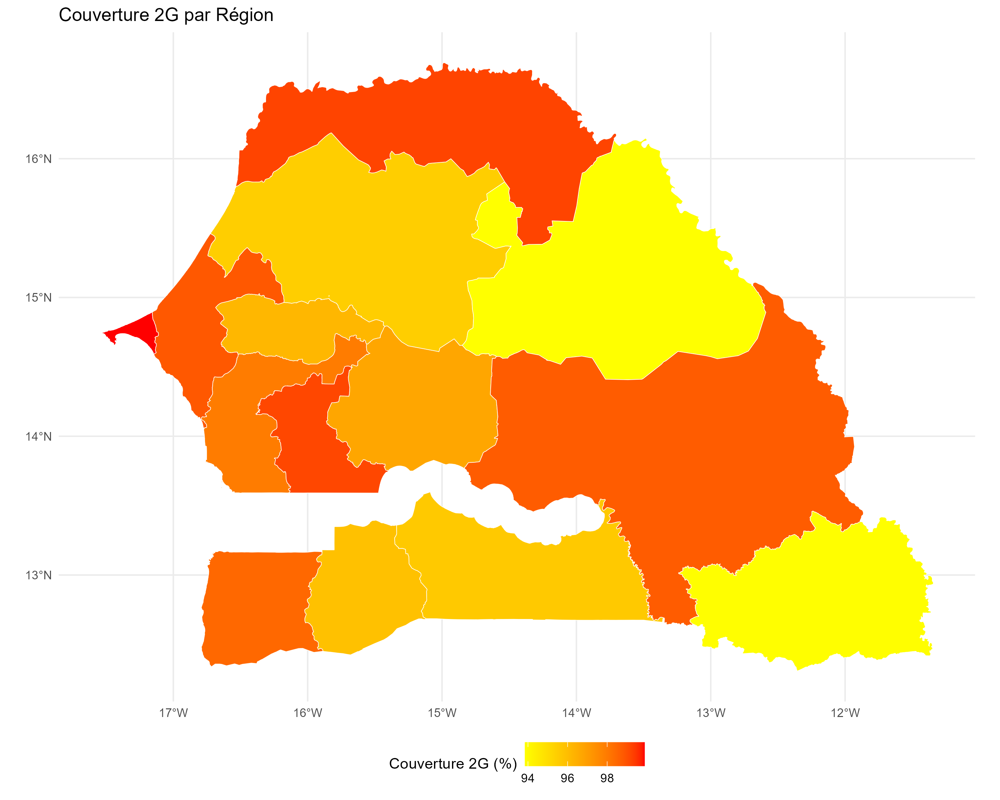
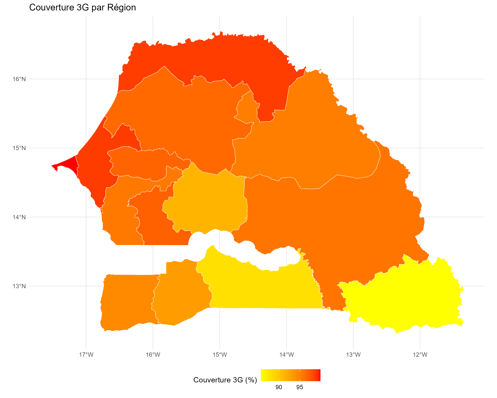
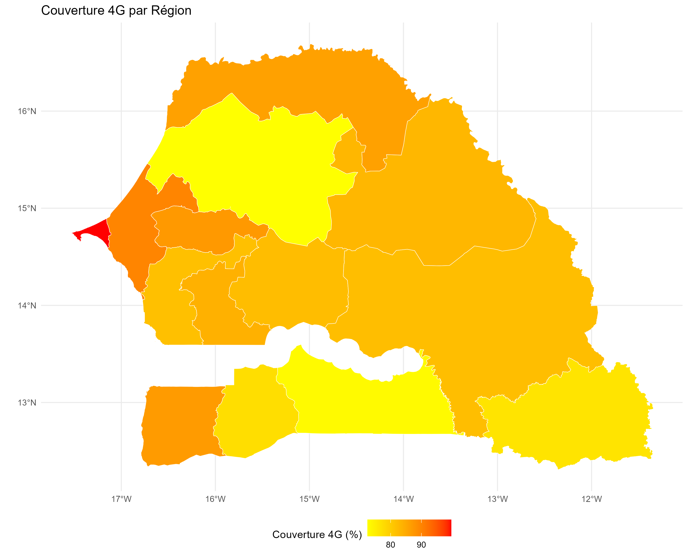
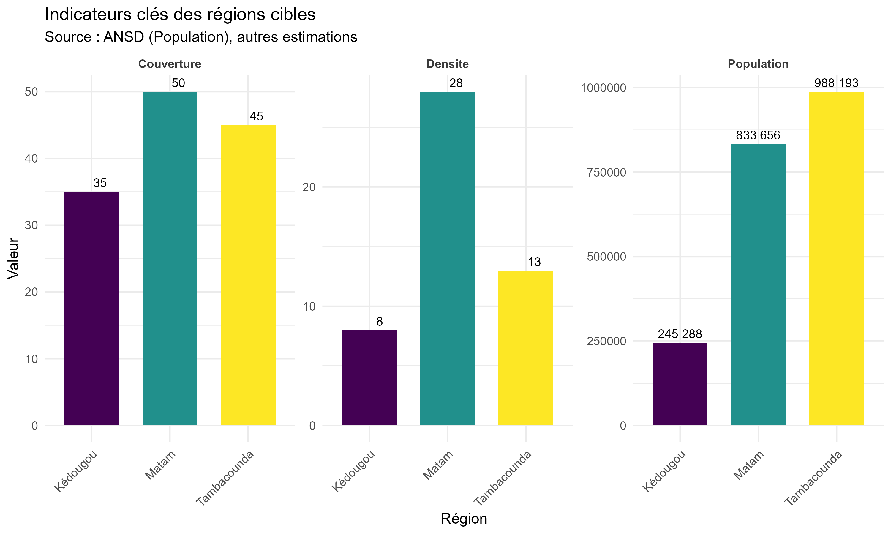

# Contexte  {#contexte}

## Présentation générale du Sénégal

Le Sénégal, situé en Afrique de l'Ouest, compte une population estimée à plus de 18 millions d'habitants en 2023 (source : ANSD). Le pays présente une grande diversité géographique, allant des zones sahéliennes du nord-est aux forêts tropicales du sud-est. Les infrastructures numériques sont principalement concentrées dans les grandes agglomérations de l'ouest (Dakar, Thiès, Mbour).

###  Indicateurs clés

- **Superficie** : 196 722 km²
- **Nombre de régions** : 14
- **Taux d'urbanisation** : ~47%
- **Accès à Internet (2022)** : ~58%, mais avec de fortes disparités régionales


## Couverture réseau : un paysage inégal

Malgré un développement significatif des réseaux 3G/4G en milieu urbain, de nombreuses zones rurales restent sous-connectées. Cette situation limite :

- L'accès aux services publics (santé, éducation)
- Les opportunités économiques locales
- Le développement de l'e-administration et des innovations numériques


### 📱 État de la couverture réseau mobile
La couverture réseau au Sénégal est marquée par des disparités importantes :


- La couverture 2G/3G/4G/5G
- La qualité du signal par opérateur
- Les débits moyens
- La latence


### 📊 Analyse par opérateur

Les trois principaux opérateurs du Sénégal (Orange, Free, Expresso) présentent des couvertures différentes :

```{r operator-coverage, echo=FALSE, fig.cap="Comparaison de la couverture par opérateur", message=FALSE}
library(ggplot2)
library(tidyr)

# Données de couverture par opérateur (exemple)
operator_data <- data.frame(
  Region = c("Dakar", "Thiès", "Saint-Louis", "Tambacounda", "Kédougou", "Matam"),
  Orange = c(95, 85, 80, 45, 35, 50),
  Free = c(90, 80, 75, 40, 30, 45),
  Expresso = c(85, 75, 70, 35, 25, 40)
)

operator_long <- pivot_longer(operator_data, 
                            cols = c(Orange, Free, Expresso),
                            names_to = "Operateur",
                            values_to = "Couverture")

ggplot(operator_long, aes(x = Region, y = Couverture, fill = Operateur)) +
  geom_bar(stat = "identity", position = "dodge") +
  scale_fill_manual(values = c("Orange" = "orange", "Free" = "red", "Expresso" = "green")) +
  labs(title = "Couverture réseau par opérateur et par région",
       x = "Région",
       y = "Pourcentage de couverture",
       fill = "Opérateurs") +
  theme_minimal() +
  theme(axis.text.x = element_text(angle = 45, hjust = 1))
```

### 🌍 Cartes  de couverture réseau


```{r , echo=FALSE, fig.align='center', out.width='50%'}
# Vous pouvez ajouter le logo de l'ENSAE ici si vous en avez un

```

la région de Dakar, la couverture 2G est presque totale, tandis que les zones rurales comme Tambacounda et Kédougou souffrent d'une couverture très limitée.

```{r , echo=FALSE, fig.align='center', out.width='50%'}
# Vous pouvez ajouter le logo de l'ENSAE ici si vous en avez un

```

Dans la carte de couverture 3G, on observe une amélioration significative dans les zones urbaines, mais des lacunes persistent dans les régions rurales.


```{r , echo=FALSE, fig.align='center', out.width='50%'}
# Vous pouvez ajouter le logo de l'ENSAE ici si vous en avez un

```


La carte de couverture 4G montre une concentration de la couverture dans les grandes villes notamment à Dakar , tandis que les zones rurales restent largement sous-couvertes, avec des débits souvent insuffisants pour les usages modernes.

<div class="carte-nperf">
  <iframe 
    src="https://www.nperf.com/fr/map/SN/-/-/signal?ll=14.510831004095923&lg=-14.439999999999996&zoom=7" 
    width="100%" 
    height="600px" 
    frameborder="0" 
    style="border:0;" 
    allowfullscreen="" 
    loading="lazy"
    referrerpolicy="no-referrer-when-downgrade">
  </iframe>
  <p class="caption">
    <strong>Figure X.X :</strong> Carte de couverture réseau au Sénégal 
    <em>(Source: <a href="https://www.nperf.com" target="_blank">nPerf</a>)</em>
  </p>
</div>


## 🔍 Zones prioritaires pour l'optimisation


L'analyse de la couverture réseau révèle plusieurs zones prioritaires pour l'optimisation :

1. **Zones à forte densité de population**
   - Dakar et sa banlieue
   - Thiès et ses environs
   - Saint-Louis

2. **Zones rurales sous-couvertes**
   - Tambacounda
   - Kédougou
   - Matam

3. **Zones de développement économique**
   - Zones industrielles
   - Centres commerciaux
   - Zones touristiques

## Présentation des régions cibles

Nous mettons l'accent sur Tambacounda, Kédougou et Matam, trois régions orientales particulièrement touchées par un faible taux de couverture réseau.

### Tambacounda

- **Population** : ~826 000 habitants
- **Densité** : ~13 hab/km²
- **Caractéristiques** : Région la plus vaste du pays, forte ruralité
- **Situation réseau** : Zones blanches fréquentes, faible couverture 4G

###  Kédougou

- **Population** : ~245 000 habitants
- **Densité** : ~8 hab/km²
- **Caractéristiques** : Région enclavée, relief montagneux
- **Situation réseau** : Couverture très limitée, difficultés d'accès aux services

###  Matam

- **Population** : ~730 000 habitants
- **Densité** : ~28 hab/km²
- **Caractéristiques** : Région du fleuve, forte mobilité saisonnière
- **Situation réseau** : Couverture mobile incomplète

```{r logo, echo=FALSE, fig.align='center', out.width='50%'}
# Vous pouvez ajouter le logo de l'ENSAE ici si vous en avez un

```

## Analyse socio-économique

### Données démographiques

- La population connaît une croissance soutenue, avec un taux de fécondité élevé et une espérance de vie en augmentation.
- Plus de 60% de la population a moins de 25 ans, ce qui représente à la fois un atout (dividende démographique) et un défi (besoins accrus en éducation, emploi et services sociaux).
- Une migration rurale-urbaine accélère la concentration dans les villes de l’ouest, accentuant les disparités régionales.

### Besoins en connectivité

- Accès inégal à la téléphonie et à Internet
- Faible accès aux services de santé, d'éducation et d'état civil en ligne
- Potentiel de développement rural par le numérique sous-exploité

---

*Ce chapitre présente le contexte géographique et socio-économique des régions cibles de notre étude. Le chapitre suivant abordera le cadre théorique de l'optimisation du placement des antennes.*
