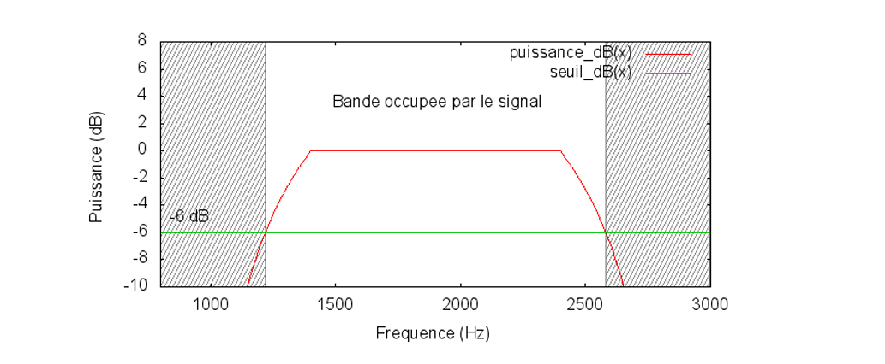

```{r setup, include=FALSE}
knitr::opts_chunk$set(echo = FALSE, 
                      cache = TRUE,
                      warning = FALSE, 
                      message = FALSE,
                      comment = NA)

```


# Introduction


Au Sénégal, comme dans de nombreux pays en développement, l’accès équitable à la connectivité mobile constitue un enjeu majeur. Malgré les avancées technologiques, de nombreuses zones rurales restent encore mal desservies, avec une qualité de service limitée. Cette situation creuse la fracture numérique et freine le développement socio-économique de territoires pourtant porteurs de potentiel.

Dans ce contexte, le **placement des antennes de télécommunication** devient une problématique stratégique. Il ne s'agit pas seulement de couvrir les zones densément peuplées, mais également d'assurer une couverture efficace dans les **zones reculées**, souvent difficiles d’accès, où les contraintes géographiques, économiques et techniques rendent le déploiement complexe. Une mauvaise répartition des stations de base peut engendrer des zones blanches, une mauvaise qualité de service ou encore des interférences entre antennes utilisant les mêmes fréquences.

Ce projet vise ainsi à étudier **l’optimisation du placement des antennes**, avec pour objectif une **meilleure couverture réseau** tout en **réduisant les interférences**. L’approche prend en compte les réalités du terrain, notamment la **propagation des ondes**, la **répartition des fréquences**, ainsi que les **contraintes budgétaires** liées à l’installation et à l’entretien des infrastructures.

Face à la complexité des réseaux actuels, il devient essentiel de recourir à des outils d’aide à la décision basés sur la simulation et l’optimisation. Ce travail propose le développement et l’implémentation d’un modèle de réseau adapté, permettant de tester différentes configurations de placement et d’affectation de fréquence. Deux techniques d’optimisation sont mobilisées : un **algorithme de recherche directe** (MADS) et une **métaheuristique** (la recherche tabou), afin d’explorer efficacement l’espace des solutions possibles.

Les résultats obtenus permettront d’évaluer la performance de la méthode proposée et d’ouvrir la voie à une application à grande échelle dans le contexte sénégalais, en vue de réduire les inégalités d’accès au numérique et d’optimiser l’usage des ressources technologiques disponibles.


---


# Généralités sur les Réseaux de télécommunicatin 

##  canaux de communication

 En télécommunications ou dans les réseaux informatiques, un canal de commu
nication est un médium de transmission d’information, permettant l’acheminement
 d’un message d’une ou plusieurs sources à un ou plusieurs destinataires. Cette trans
mission d’information peut se faire au travers d’un support physique, comme un câble,
 ou d’un support logique, comme un canal radio.
 


## Spectre de fréquence d’un signal

Lors de la transmission d’un signal dans un câble ou dans l’air, celui-ci est de nature analogique. Pour comprendre comment il transporte l'information, on analyse sa composition fréquentielle à l’aide de la **transformée de Fourier**.

Cette analyse permet d'obtenir le **spectre de fréquences** du signal, c’est-à-dire la répartition de sa puissance selon les différentes fréquences. Pour les signaux réels, l’énergie est souvent concentrée dans une **bande passante limitée**. En dessous d’un certain seuil, la puissance est négligeable, ce qui permet de **délimiter la bande utile** du signal.

### Illustration en R

```{r}
library(ggplot2)

# Simulation d’un signal : somme de sinusoïdes
f1 <- 50   # Hz
f2 <- 120  # Hz
sampling_rate <- 1000  # Hz
duration <- 1          # seconde
t <- seq(0, duration, by = 1/sampling_rate)
signal <- sin(2*pi*f1*t) + 0.5*sin(2*pi*f2*t)

# Transformée de Fourier
fft_vals <- abs(fft(signal))^2
freq <- seq(0, sampling_rate, length.out = length(fft_vals))

# Création du spectre
df_spectrum <- data.frame(
  Frequency = freq[1:(length(freq)/2)],
  Power = fft_vals[1:(length(freq)/2)]
)

# Affichage
ggplot(df_spectrum, aes(x = Frequency, y = Power)) +
  geom_line(color = "#0072B2", size = 1) +
  labs(title = "Spectre de fréquence du signal",
       x = "Fréquence (Hz)",
       y = "Puissance") +
  theme_minimal()
```

## Bande passante d’un canal

Il est très important de connaître les caractéristiques fréquentielles du canal sur
 lequel on veut transmettre de l’information. En effet, un canal ne peut transporter des
 signaux que dans une certaine bande de fréquences, appelée bande passante du canal.
 
```{r echo=FALSE, out.width="85%", fig.align='center'}

```
##  Modulation du signal

Afin de permettre la transmission d’un signal sur un support donné, il est souvent nécessaire d’adapter sa fréquence pour qu’elle corresponde à la bande passante du canal de transmission. Cette opération est réalisée par le procédé de modulation.

La modulation consiste à combiner le signal à transmettre, initialement en bande de base, avec une onde porteuse : une onde sinusoïdale de fréquence fP​ et d’amplitude $a_p$​, généralement située au centre de la bande passante du support. Mathématiquement, cette onde porteuse peut s’écrire :
$$
s_P(t) = a_P \cos(2\pi f_P t)
$$
```{r}
# Paramètres
f_port <- 50      # Fréquence porteuse (Hz)
f_mod <- 5        # Fréquence du signal modulant (Hz)
a_p <- 1          # Amplitude de la porteuse
m <- 0.5          # Indice de modulation
Fs <- 1000        # Fréquence d'échantillonnage
t <- seq(0, 1, by = 1/Fs)

# Signal modulant (bande de base)
modulant <- sin(2 * pi * f_mod * t)

# Porteuse
porteuse <- a_p * cos(2 * pi * f_port * t)

# Signal modulé en amplitude (AM)
module <- (1 + m * modulant) * porteuse

# Visualisation
library(ggplot2)
library(tidyr)
df <- data.frame(
  t = t,
  Porteuse = porteuse,
  Modulant = modulant,
  Signal_Modulé = module
)

df_long <- pivot_longer(df, -t, names_to = "Signal", values_to = "Amplitude")

ggplot(df_long, aes(x = t, y = Amplitude, color = Signal)) +
  geom_line() +
  labs(title = "Modulation d'un signal : onde modulante, porteuse et signal modulé (AM)",
       x = "Temps (s)", y = "Amplitude") +
  theme_minimal()

```


En modulant cette onde avec le signal d’origine, on obtient un signal modulé dont le spectre est déplacé autour de la fréquence fPf​. Ce nouveau signal respecte les contraintes fréquentielles du support et peut donc être transmis efficacement.

## Capacité d’un canal de transmission – Théorie de Shannon

Les signaux électromagnétiques transmis dans un réseau de télécommunications sont, comme vu précédemment, des **signaux modulés**. Leur spectre est étalé autour d’une fréquence centrale, en fonction de la technique de modulation utilisée. 

Or, le **canal de transmission**, ici l’air, ne permet de transmettre que certaines fréquences : c’est ce qu’on appelle la **bande passante** du canal, notée \( \Delta f \). Elle représente l’intervalle de fréquences que le support peut transmettre sans atténuation excessive.

La **théorie de l’information de Shannon** établit un lien fondamental entre cette bande passante et la **capacité maximale** du canal à transporter de l’information, exprimée en bits par seconde :

$$
C_I = \Delta f \cdot \log_2 \left(1 + \frac{P_S}{P_N} \right)
$$

**Avec :**
- \( C_I \) : capacité du canal (en bits/s) ;
- \( \Delta f \) : largeur de bande (Hz) ;
- \( P_S \) : puissance du signal reçu ;
- \( P_N \) : puissance du bruit (perturbations).

Cette formule montre que plus **la bande passante** est large, plus le canal est capable de transporter de l’information, à condition que le **rapport signal/bruit (SNR)** soit favorable. C’est pourquoi la **gestion efficace du spectre** et la **réduction des interférences** sont cruciales dans la conception des réseaux de télécommunications.


# Modélisation de la propagation des ondes

## Modèle de propagation dans le vide (Equation de Friis)

Dans le modèle idéalisé sans obstacles (propagation en espace libre), la puissance reçue est donnée par **l’équation de Friis** :

$$
P_r(d) = \frac{P_t G_t G_r \lambda^2}{(4 \pi d)^2 L}
$$

**Où :**
- $P_r(d)$ : puissance reçue à une distance $d$
- $P_t$ : puissance transmise
- $G_t$, $G_r$ : gain des antennes émettrice et réceptrice
- $\lambda$ : longueur d’onde ($\lambda = c / f$)
- $L$ : pertes système (câbles, connecteurs...)
- $d$ : distance entre émetteur et récepteur

En dB, cela devient :

$$
P_r(dB) = P_t(dB) + G_t(dB) + G_r(dB) - 20\log_{10}(4\pi d / \lambda) - L(dB)
$$

## Modèles plus réalistes

- **Modèle à deux trajets (sol) :** présence d'un trajet direct + un trajet réfléchi sur le sol.
- **Modèle de diffraction (Ikegami, Walfisch-Bertoni)** : prise en compte de la géométrie urbaine.

## Loi de décroissance de la puissance (modèle général)

$$
P_r(d) = P_0 \left(\frac{d_0}{d}\right)^n
$$

- $P_0$ : puissance à distance référence $d_0$
- $n$ : coefficient d’affaiblissement (entre 2 et 5)

---

# Multiplexage et répartition des fréquences

## Multiplexage Fréquentiel (FDMA)

On divise le spectre en $N$ canaux :

$$
B_{total} = N \cdot B_{canal}
$$

Chaque utilisateur utilise un canal fixe.

## Multiplexage Temporel (TDMA)

Le temps est divisé en $C$ créneaux de durée $T$ :

$$
T_{total} = C \cdot T
$$

Chaque utilisateur communique à tour de rôle.

## Combiné TDMA/FDMA

Chaque canal fréquentiel est subdivisé en créneaux temporels, pour une meilleure utilisation du spectre.

---

# Optimisation du placement des antennes

## Objectif de couverture

Donnons un modèle mathématique :

Soit $x_i$ les coordonnées des antennes à placer, $y_j$ les points à couvrir.

- $P_{ij}$ : puissance reçue à $y_j$ depuis l’antenne $i$.
- $\gamma$ : seuil minimum de puissance.

**Contraintes :**

$$
P_{ij} \geq \gamma \quad \text{pour tous } j \,\Rightarrow \, y_j \,\text{est couvert}
$$

**Fonction objectif (par exemple) :**

- Max. nombre de points couverts
- Min. nombre d'antennes placées
- Max. somme de puissances reçues (pondérées)

## Modèles d'interférences

Le rapport signal-bruit (SNR) :

$$
\text{SNR} = \frac{P_{signal}}{P_{bruit} + P_{interférences}}
$$

Une zone est jugée couverte si $\text{SNR} \geq \theta$ (seuil).

---

# Optimisation de l'assignation de fréquences

On affecte à chaque antenne $i$ une fréquence $f_i \in \mathcal{F}$.

Objectif : 

$$
\min \sum_{(i,j) \in \text{Paires}} I_{ij}(f_i, f_j)
$$

- $I_{ij}$ : fonction modélisant les interferences entre antennes $i$ et $j$.

C’est un **problème combinatoire**, souvent traité par :

- Algorithmes gloutons
- Algorithmes génétiques
- Recuit simulé (simulated annealing)
- Programmation linéaire en nombres entiers (MILP)

---

# Optimisation conjointe (placement + fréquence)

Fonction objectif conjointe :

$$
\min \Big[ \text{coût}_{placement} + \text{interférences} \Big]
$$

On doit déterminer simultanément :

- Coordonnées $x_i$ des antennes
- Fréquences $f_i$ associées

Algorithmes utilisables :

- Algorithmes évolutionnaires multi-objectifs
- Algorithmes hybrides

---

# Implémentation R (idées)

- Simuler une grille 10x10 avec `expand.grid()`
- Calculer les distances et puissances avec `dist()` et la formule de Friis
- Optimisation via `optim()`, `GA`, `GenSA`
- Visualisation avec `ggplot2`, `leaflet`, `shiny`

---

# Conclusion

Ce projet propose une modélisation rigoureuse du placement optimal des antennes, intégrant les principes physiques de propagation, les contraintes réseaux, et l’optimisation combinatoire. Il peut servir de base à une application Shiny interactive pour l’analyse territoriale au Sénégal.
